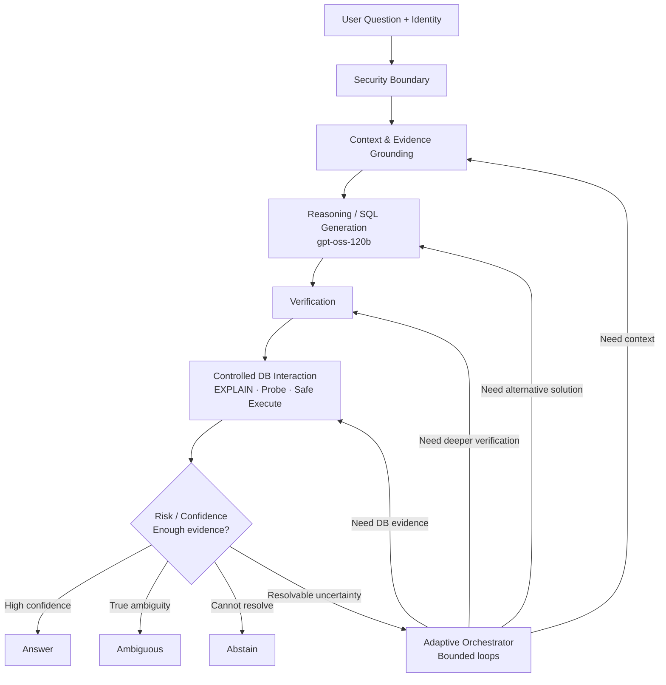

# T2S — Production-First, Accuracy-First NL-to-SQL

**Status:** Candidate production specification, September 2026.  
**Principle:** requirements first, architecture second. The previous T0–T6 decomposition is retained only as historical/reference material, not as a mandatory production shape.

## One-sentence definition

T2S is an enterprise NL-to-SQL system whose primary objective is to maximize **trustworthy answer coverage** under a required precision/reliability level, using authorized metadata, database evidence, `gpt-oss-120b`, verification, safe execution and calibrated abstention.

## What is fixed

- Production usefulness: correct answers, useful coverage, reliability, security, maintainability and generalization.
- `gpt-oss-120b` on company vLLM is the maximum reasoning/generation model; no fine-tuning is assumed.
- OpenMetadata is a major metadata source, not automatically the semantic truth.
- Read-only and access control are enforced below the LLM.
- The system must be able to answer, expose a specific ambiguity, or abstain.

## What is *not* fixed

Agentic loops, T0–T6, IR, semantic layers, Wren, Vanna, graph algorithms, multi-solver generation and LLM judges are all **candidate mechanisms**. They remain only if measurements show production utility.

## Canonical capability flow

## Documents

1. `01_PRODUCT_CONTRACT.md` — business objective and non-negotiable constraints.
2. `02_REQUIREMENTS_AND_SUCCESS_METRICS.md` — measurable acceptance criteria.
3. `03_CANONICAL_CANDIDATE_ARCHITECTURE.md` — candidate production architecture and rationale.
4. `04_CONTEXT_AND_EVIDENCE_GROUNDING.md` — OpenMetadata, retrieval, values, history and probing.
5. `05_REASONING_VERIFICATION_ORCHESTRATION.md` — generation, verification and bounded loops.
6. `06_SEMANTIC_BRANCH_AND_PUBLIC_SYSTEMS.md` — Wren/Vanna/DB-GPT and build-vs-reuse.
7. `07_EVALUATION_AND_DECISION_PROTOCOL.md` — how mechanisms are kept/rejected.
8. `08_PRODUCTION_SECURITY_OPERABILITY.md` — security, observability and operations.
9. `09_ROADMAP_AND_DELIVERY_PLAN.md` — delivery sequence to production.
10. `10_EVIDENCE_REGISTER.md` — evidence, source quality and caveats.
11. `11_DECISION_LOG_AND_OPEN_HYPOTHESES.md` — what remains unproven.

Evidence status used throughout:
[E] externally or internally measured evidence; [I] hard technical/security invariant; [S] strong engineering inference that still requires measurement; [H] open hypothesis/candidate mechanism.
