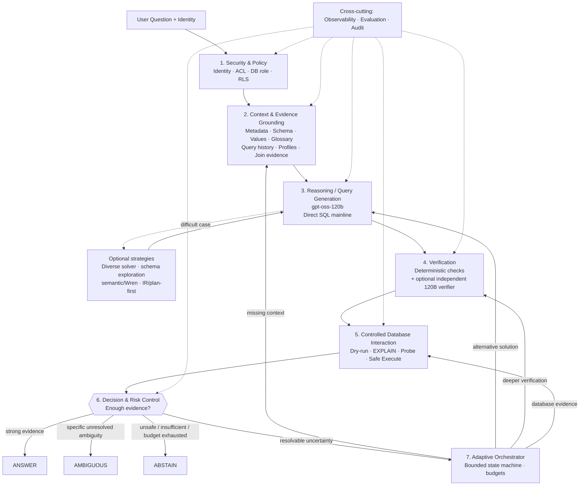
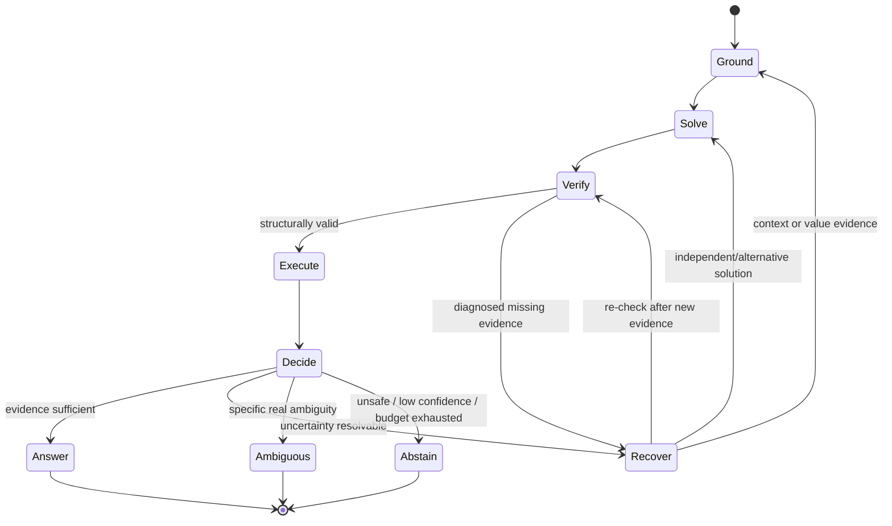

# 03 — Canonical Candidate Production Architecture

> This is a **candidate architecture**, not a mandatory T0–T6 decomposition. The required capabilities are stable; their implementation is replaceable.

## 1. Architecture

## 2. Why these capabilities exist

| Capability | Rationale | Evidence status |
|---|---|---|
| Security & Policy | Unauthorized data access cannot be delegated to model behavior. | [I] |
| Context/Evidence Grounding | 9,000-table catalog cannot be placed wholesale in prompt; large-schema linking is a known bottleneck. AutoLink/Spider 2.0 support treating this as a first-class problem. | [I]+[E] |
| Reasoning/Generation | 120B is the company ceiling; direct SQL is the least-assumption baseline. Diverse reasoning is optional when difficult cases justify it. | [S]+[E] |
| Verification | Internal errors are largely semantic; PV-SQL/VET/DPC and selective-prediction evidence support verification/evidence gathering, but no single verifier is an oracle. | [E]+[S] |
| Controlled DB Interaction | DB feedback provides observable evidence and is also the security/control boundary. | [I]+[E] |
| Decision/Risk | Correctness uncertainty must be converted into answer/abstain behavior. Raw vote or self-confidence is insufficient. | [E]+[S] |
| Adaptive Orchestrator | Avoid paying complex-agent cost on easy cases; escalate only for identified uncertainty. | [S], must be benchmarked |

## 3. Normal path vs escalation

### Normal path

`Security -> Grounding -> single 120B Direct SQL -> deterministic verification -> dry-run/execute -> risk decision`.

### Escalation path

Triggered only by a diagnosed uncertainty:

- schema uncertainty -> targeted schema exploration;
- unresolved value/business term -> lookup/probe;
- SQL logic uncertainty -> alternative solver strategy;
- execution/dialect failure -> structured diagnostics and at most one targeted repair;
- semantic uncertainty -> independent verifier or optional semantic branch.

Generic "think again" loops without new evidence are not a default mechanism because internal experiments showed repeated generic refinement can be ineffective.

## 4. Bounded loop

Budgets (rounds, probes, solver calls, verifier calls) are configuration values to be learned from workload data, not hard-coded scientific truths.

## 5. Architecture invariants

- The LLM never bypasses security or DB gateway controls.
- Every final answer has an auditable evidence trail.
- Every loop is bounded and tied to a specific uncertainty/evidence goal.
- The direct-SQL path works even if semantic/IR/agentic branches are disabled.
- Optional branches use common verification, execution and decision interfaces so they can be compared fairly.
