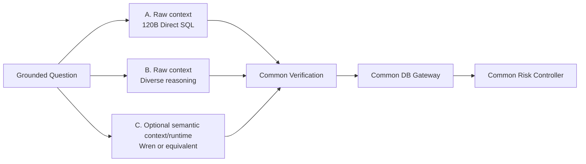

# 06 — Semantic Branch and Public-System Reuse

## 1. Principle

Semantic modeling is **not** a mandatory core of T2S. It is a replaceable candidate mechanism intended to reduce metric/grain/business-semantic errors and/or maintenance burden. Keep it only if comparative evaluation shows benefit.

## 2. Semantic branch



Comparison must hold the rest of the system constant.

## 3. Wren AI

Current Wren exposes MDL semantic context, memory/query history, planning, `dry-plan`, `dry-run`, connectors and context-retrieval primitives. It is therefore a strong candidate **semantic runtime adapter**, not automatically the architecture core. [S13–S15]

Recommended integration boundary:

```text
SemanticRuntimePort
- get_context(question, scope)
- plan(candidate)
- dry_run(candidate)
- compile(candidate, dialect)
```

Adapters can include `RawSchemaRuntime`, `WrenRuntime`, and a future custom runtime.

## 4. Vanna

Vanna 2.0 is useful as an architectural/UI/tool-runtime reference, but its public repository was archived in March 2026. Treat it as a reference or prototype shell unless a maintained enterprise path is confirmed; avoid making an archived OSS repo a new load-bearing dependency without a maintenance plan. [S16]

## 5. DB-GPT

DB-GPT is a useful reference for agent/tool orchestration, SQL/code execution, multi-source access and skills. It is broader than the accuracy core of T2S, so adopt individual runtime ideas/components only after fit-gap testing. [S17]

## 6. Build-vs-reuse rule

Preferred order:

`USE -> WRAP -> EXTEND -> FORK -> REWRITE`.

A custom implementation is justified only when:

1. the capability is material to production quality;
2. an existing maintained system cannot satisfy the requirement cleanly;
3. controlled comparison shows enough benefit to pay maintenance cost.

## 7. Semantic branch acceptance

Compare at least:

- A: raw selected metadata -> direct SQL;
- B: raw metadata + semantic context -> direct SQL;
- C: semantic runtime (e.g., Wren) -> physical SQL.

Report overall precision/coverage and slices for metric, grain, join, maintenance effort and latency. If semantic machinery does not materially improve production utility, do not force it into the main path.
