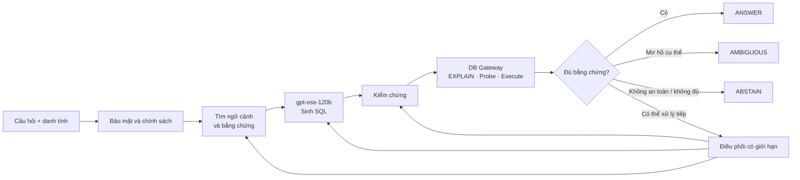
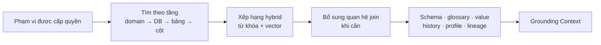
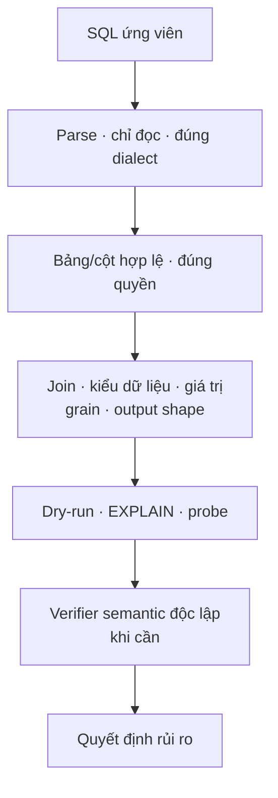
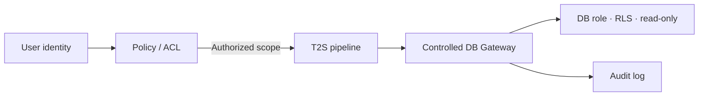
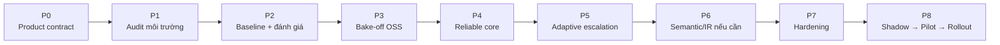
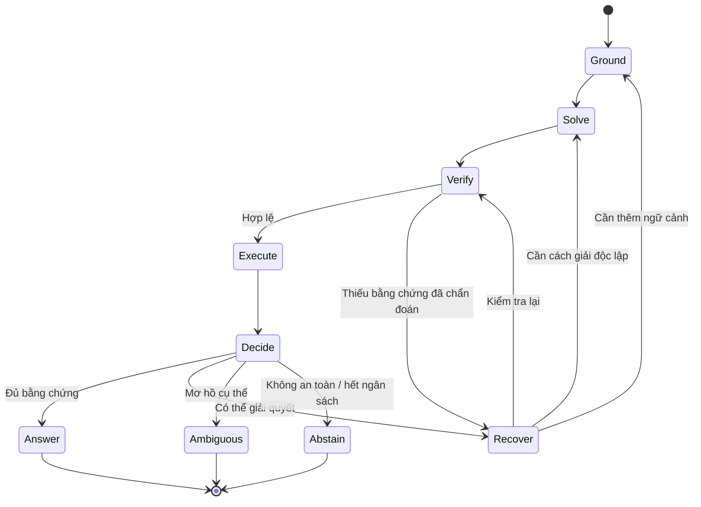
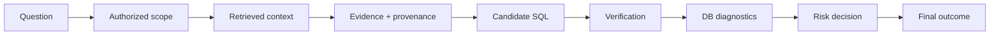

# T2S - Nội dung báo cáo lãnh đạo

## Cách dùng tài liệu

- Bộ trình bày chính gồm 15 slide, phù hợp cho 15-20 phút.
- **Trên slide** là nội dung hiển thị; **Lời dẫn** là phần người báo cáo trình bày.
- Số liệu từ dự án cũ chỉ là tham chiếu, không phải kết quả production của T2S.
- Trạng thái hiện tại: **đặc tả production đề xuất, tháng 09/2026**.

---

## Slide 1 - T2S: Hỏi dữ liệu doanh nghiệp bằng ngôn ngữ tự nhiên

### Trên slide

**T2S - Production-first, Accuracy-first NL-to-SQL**

Từ câu hỏi tiếng Việt/tiếng Anh đến câu trả lời có thể kiểm chứng trên dữ liệu doanh nghiệp.

- Quy mô mục tiêu: khoảng 9.000 bảng, nhiều hệ quản trị dữ liệu
- Mô hình tối đa: `gpt-oss-120b` trên hạ tầng vLLM nội bộ
- Ưu tiên: đúng, an toàn, truy vết được, sau đó mới tới tốc độ

### Lời dẫn

“T2S giúp người dùng nghiệp vụ tự khai thác dữ liệu bằng ngôn ngữ tự nhiên. Đây không chỉ là bài toán sinh một câu SQL chạy được. Mục tiêu là đưa ra câu trả lời đáng tin cậy, đúng quyền truy cập và có đủ bằng chứng để kiểm tra lại.”

**Gợi ý hình:** “Doanh thu tháng này theo khu vực?” → “Kết quả + SQL + giải thích + bằng chứng”.

---

## Slide 2 - Bài toán cần giải quyết

### Trên slide

- Dữ liệu phân tán trên ClickHouse, StarRocks và PostgreSQL
- Catalog lớn, không thể đưa toàn bộ schema vào một prompt
- Thuật ngữ nghiệp vụ, giá trị và cách tính có thể không đồng nhất
- SQL “chạy được” vẫn có thể trả về kết quả sai nhưng rất thuyết phục

> Rủi ro lớn nhất: **wrong-but-plausible - sai nhưng trông có vẻ đúng**.

### Lời dẫn

“Nếu chỉ tối ưu để sinh SQL, hệ thống có thể tạo câu lệnh hợp lệ nhưng sai bảng, sai phép join, sai công thức hoặc sai mốc thời gian. Loại lỗi này khó phát hiện hơn lỗi cú pháp và có thể dẫn tới quyết định kinh doanh sai.”

---

## Slide 3 - Mục tiêu sản phẩm

### Trên slide

> Tối đa hóa tỷ lệ câu hỏi được trả lời đáng tin cậy, trong giới hạn độ chính xác bắt buộc.

| Kết quả | Khi nào sử dụng |
|---|---|
| **ANSWER** | Đủ bằng chứng và vượt ngưỡng rủi ro |
| **AMBIGUOUS** | Có một điểm mơ hồ cụ thể cần làm rõ |
| **ABSTAIN** | Thiếu bằng chứng, ngoài phạm vi, không an toàn hoặc hết ngân sách |

Giả thuyết nghiệm thu ban đầu: **precision ≥ 85% tại coverage ≥ 55%**.

### Lời dẫn

“Chúng ta không trả lời bằng mọi giá, cũng không muốn hệ thống từ chối quá nhiều. T2S cần cân bằng độ đúng của phần đã trả lời với tỷ lệ câu hỏi thực sự phục vụ được. Mốc 85/55 là giả thuyết để kiểm chứng, chưa phải SLA chính thức.”

---

## Slide 4 - Phạm vi giai đoạn đầu

### Trên slide

| Trong phạm vi | Chưa thuộc phạm vi đầu |
|---|---|
| Câu hỏi nghiệp vụ bằng tiếng Việt/Anh | Ghi, sửa hoặc xóa dữ liệu |
| Tìm schema và bằng chứng ở quy mô doanh nghiệp | Agent tự chủ không giới hạn |
| Sinh, kiểm tra và thực thi SQL chỉ đọc | Bắt buộc hội thoại nhiều lượt |
| Kết quả, SQL, giải thích và dấu vết bằng chứng | Semantic model cho toàn bộ 9.000 bảng |
| Kiểm soát theo danh tính, vai trò và RLS | Fine-tune mô hình 120B |

### Lời dẫn

“Phạm vi đầu được giới hạn để đưa giá trị vào production một cách kiểm soát. Semantic layer, IR hay nhiều solver chỉ được đưa vào khi thực nghiệm cho thấy chúng giải quyết một nhóm lỗi đáng kể.”

---

## Slide 5 - Sáu nguyên tắc thiết kế

### Trên slide

1. **Bài toán trước, công nghệ sau** - mỗi thành phần gắn với một lỗi đo được.
2. **Bằng chứng trước độ tin cậy** - không dùng tự tin của LLM làm xác suất đúng.
3. **Bảo mật nằm bên dưới LLM** - ACL, DB role, RLS và read-only do hạ tầng cưỡng chế.
4. **Đơn giản trước, phức tạp sau** - direct SQL là đường cơ sở.
5. **Phục hồi có giới hạn** - chỉ lặp khi có thể lấy thêm bằng chứng mới.
6. **Thành phần có thể thay thế** - hạn chế phụ thuộc framework.

### Lời dẫn

“Kiến trúc không bắt đầu bằng câu hỏi cần bao nhiêu agent. Nó bắt đầu từ lỗi thực tế và ràng buộc production. Mỗi lớp chỉ được giữ lại khi đóng góp của nó đo được.”

---

## Slide 6 - Kiến trúc năng lực đề xuất

### Trên slide

### Lời dẫn

“Đường bình thường gồm tìm ngữ cảnh, sinh SQL, kiểm chứng và thực thi an toàn. Khi phát hiện một bất định cụ thể, bộ điều phối mới quay lại đúng công đoạn cần thiết. Tất cả các nhánh dùng chung lớp bảo mật, DB Gateway và bộ quyết định rủi ro.”

---

## Slide 7 - Grounding: lấy đúng và đủ ngữ cảnh

### Trên slide

Mục tiêu: **ngữ cảnh nhỏ nhất nhưng đủ, đúng quyền và giàu bằng chứng**.

- OpenMetadata là nguồn metadata lớn, không mặc nhiên là “semantic truth”
- Query history là bằng chứng hành vi; tần suất không đồng nghĩa với đúng
- Probe có kiểm soát giúp xác minh giá trị và ý nghĩa cột
- Điểm mơ hồ không giải quyết được phải được ghi nhận, không được đoán

### Lời dẫn

“Với 9.000 bảng, nút thắt đầu tiên là tìm đúng phạm vi dữ liệu. T2S lọc quyền trước, tìm theo tầng, sau đó chỉ đưa các bảng và cột liên quan vào mô hình. Mọi bằng chứng cần có nguồn gốc và thời điểm.”

---

## Slide 8 - Sinh SQL và xử lý câu khó

### Trên slide

**Đường chính:** Grounded Context → `gpt-oss-120b` → Direct SQL

- Ít giả định kiến trúc, giữ được độ biểu đạt của SQL
- Tạo baseline rõ ràng để đo từng cải tiến
- Tăng reasoning effort khi mức độ khó yêu cầu

| Bất định đã chẩn đoán | Hành động mục tiêu |
|---|---|
| Thiếu schema | Tìm/inspect thêm schema liên quan |
| Giá trị hoặc thuật ngữ chưa rõ | Lookup/probe có tham số |
| Lỗi dialect/runtime | Sửa một lần theo diagnostic cụ thể |
| Logic SQL chưa chắc | Cách giải khác biệt hoặc verifier độc lập |

### Lời dẫn

“Hệ thống không lặp lại yêu cầu ‘hãy suy nghĩ lại’. Mỗi vòng lặp phải lấy thêm bằng chứng hoặc tạo cách giải độc lập, đồng thời số vòng luôn bị giới hạn.”

---

## Slide 9 - Kiểm chứng nhiều lớp

### Trên slide

**Ưu tiên:** DB quan sát được > bất biến tất định > kiểm tra độc lập > LLM judge > đồng thuận ứng viên.

### Lời dẫn

“Verifier LLM không phải trọng tài tuyệt đối vì có thể có cùng điểm mù với model sinh SQL. T2S ưu tiên những gì có thể quan sát và kiểm tra: quyền truy cập, cú pháp, bảng/cột, EXPLAIN, probe và các bất biến nghiệp vụ.”

---

## Slide 10 - Bảo mật và khả năng kiểm toán

### Trên slide

- Xác định danh tính và phạm vi được phép **trước khi tìm metadata**
- DB role/RLS/read-only được cưỡng chế ở kết nối và database
- Mọi thao tác DB đi qua gateway có allow-list
- Giới hạn timeout, số dòng/byte, đồng thời và chi phí truy vấn
- ACL không khả dụng → fail closed
- Cache key bao gồm vai trò/chính sách và phiên bản metadata

### Lời dẫn

“LLM không bao giờ là lớp bảo mật. Kể cả khi model sinh SQL ngoài phạm vi, DB Gateway và quyền tại database vẫn phải chặn nó. Dấu vết của từng yêu cầu cho phép truy ngược từ câu hỏi tới quyết định cuối.”

---

## Slide 11 - Đo thành công như thế nào?

### Trên slide

**Chỉ số chính: đường cong Risk-Coverage**

- `coverage`: tỷ lệ câu hỏi hệ thống quyết định trả lời
- `precision`: tỷ lệ đúng trong số các câu đã trả lời
- `selective risk = 1 - precision`

**Chỉ số bổ sung:** execution accuracy; recall bảng/cột; calibration; p50/p95; GPU-second; tải warehouse; lỗi theo nhóm; tổng quát hóa; **0 truy cập trái phép trong adversarial test**.

### Lời dẫn

“Một con số accuracy tổng hợp có thể che mất việc hệ thống trả lời quá ít hoặc trả lời nhiều nhưng rủi ro. Vì vậy báo cáo chính là đường risk-coverage, kèm error budget và chi phí vận hành.”

**Gợi ý biểu đồ:** trục X là Coverage, trục Y là Precision; đánh dấu `55% / 85%` và ghi rõ “mốc giả thuyết, chưa phải kết quả”.

---

## Slide 12 - Bằng chứng kế thừa từ dự án trước

### Trên slide

| Phát hiện tham chiếu | Hàm ý cho T2S |
|---|---|
| 106 ca sai ổn định; nổi bật là sai tập dòng và metric/công thức | Ưu tiên lỗi semantic, không chỉ cú pháp |
| Literal không tồn tại gắn với EX thấp hơn rõ rệt | Value grounding là tín hiệu quan trọng |
| Một thử nghiệm refinement tạo SQL giống hệt trên 855 dự đoán | Không lặp self-reflection chung chung |
| Resampling cùng prompt chỉ tăng oracle +4,68 điểm phần trăm | Cần chiến lược thực sự khác biệt |
| Mô tả cột mù quáng làm EX giảm 0,70 điểm, chi phí tăng 23,1% | Chỉ đưa mô tả liên quan vào prompt |
| Output tối giản tăng EX 1,75 điểm | Kiểm tra projection/output shape |

### Lời dẫn

“Đây là bằng chứng từ hệ thống trước để xác định ưu tiên thực nghiệm, không phải phân bố lỗi production của T2S. Các mối liên hệ cũng không được biến thành tuyên bố nhân quả khi chưa có A/B test.”

---

## Slide 13 - Build hay reuse?

### Trên slide

**USE → WRAP → EXTEND → FORK → REWRITE**

| Lựa chọn | Vai trò dự kiến | Quan điểm hiện tại |
|---|---|---|
| OpenMetadata | Metadata, lineage, profile, query history | Nguồn chính; cần audit coverage thực tế |
| Wren | Semantic context/runtime | Ứng viên bake-off, không mặc định làm core |
| Vanna | Tham chiếu UI/agent runtime | Repo OSS đã archive; rủi ro nếu làm dependency cốt lõi |
| DB-GPT | Tham chiếu orchestration/tooling | Chỉ lấy phần phù hợp sau fit-gap |
| Custom T2S | Grounding, verification và risk | Chỉ xây phần tạo giá trị đo được |

### Lời dẫn

“Chúng ta không viết lại phần mã nguồn mở đã giải quyết tốt, nhưng cũng không đưa framework vào đường critical chỉ vì nó có nhiều tính năng. Các phương án phải được so sánh trên cùng workload và cùng lớp kiểm chứng.”

---

## Slide 14 - Lộ trình đưa vào production

### Trên slide

**Gate:** mỗi phase phải có đầu ra đo được; cơ chế không cải thiện production utility sẽ bị loại hoặc hoãn.

### Lời dẫn

“Ba bước đầu giúp tránh đầu tư theo giả định: chốt mục tiêu, audit dữ liệu thật, rồi tạo baseline tái lập. Từ error budget của baseline, đội mới biết nên đầu tư vào grounding, verification, probing hay semantic. Agentic escalation và IR là các bước có điều kiện.”

---

## Slide 15 - Rủi ro và quyết định cần thông qua

### Trên slide

| Rủi ro chính | Cách kiểm soát |
|---|---|
| Metadata thiếu hoặc sai | Audit coverage, provenance, safe probe, abstain |
| SQL đúng cú pháp nhưng sai nghiệp vụ | Grounding + deterministic checks + verifier chọn lọc |
| Lộ dữ liệu/quá quyền | ACL trước retrieval, DB role/RLS, gateway, audit |
| Agent tăng chi phí và khó vận hành | Core đơn giản, escalation có ngân sách |
| Phụ thuộc OSS | Adapter thay thế được, bake-off, maintenance review |
| KPI đẹp trên benchmark nhưng kém production | Holdout, shadow traffic, pilot theo domain |

**Đề nghị lãnh đạo thông qua:**

1. Product contract và phạm vi read-only giai đoạn đầu.
2. Mốc `85% precision / 55% coverage` để bắt đầu validation.
3. Nguồn lực cho P1-P3: audit, baseline và bake-off.
4. Đầu mối nghiệp vụ để xây tập 100-200 câu hỏi và xác nhận đáp án.
5. Cơ chế phê duyệt trước khi chuyển từ shadow sang pilot.

### Lời dẫn

“Điều cần phê duyệt lúc này không phải một kiến trúc agent phức tạp hay một nhà cung cấp cụ thể. Chúng ta cần chốt tiêu chí sản phẩm, quyền truy cập để audit, tập câu hỏi nghiệp vụ có đáp án và nguồn lực tạo baseline. Sau P3, dữ liệu thực nghiệm sẽ là cơ sở cho quyết định build hay reuse.”

---

## Slide dự phòng A - Vòng lặp phục hồi có giới hạn

**Thông điệp:** mỗi vòng lặp có mục tiêu bằng chứng và giới hạn số lần gọi model, probe, verifier và repair.

---

## Slide dự phòng B - Các giả thuyết cần chứng minh

| Giả thuyết | Cách kiểm thử | Điều kiện đảo ngược |
|---|---|---|
| Adaptive orchestration tốt hơn fixed flow | So sánh quality/cost cùng workload | Giữ fixed flow nếu lợi ích nhỏ |
| Agentic schema exploration cần thiết | Static retrieval so với bounded exploration | Không dùng agent nếu static đạt recall |
| Safe probe tăng độ chính xác | No-probe so với targeted-probe | Hạn chế/tắt nếu tải DB vượt lợi ích |
| Nhiều solver tạo diversity hữu ích | Đo semantic/result diversity | Một solver + verification nếu quá tương quan |
| LLM verifier tăng selective accuracy | AUROC, calibration, risk-coverage | Bỏ nếu thêm ít tín hiệu |
| Wren/semantic giúp lỗi business | So raw, semantic context và runtime | Không vào critical path nếu không tăng utility |
| Typed IR tạo giá trị | So với direct SQL cùng điều kiện | Loại nếu giảm expressiveness hoặc tăng bảo trì |

---

## Slide dự phòng C - Dấu vết của một yêu cầu

Pin và log: metadata snapshot, query-history snapshot, semantic version, model/reasoning effort, prompt/config hash, verifier/risk version và git revision.

---

## Phân bổ thời gian

| Phần | Slide | Thời gian |
|---|---:|---:|
| Bài toán và mục tiêu | 1-5 | 5 phút |
| Giải pháp và kiểm soát | 6-10 | 7 phút |
| Cách đo, bằng chứng, lộ trình | 11-14 | 6 phút |
| Đề nghị quyết định | 15 | 2 phút |

## Câu mở đầu gợi ý

“Hôm nay tôi xin trình bày đề xuất T2S, một hệ thống cho phép người dùng hỏi dữ liệu doanh nghiệp bằng tiếng Việt hoặc tiếng Anh. Trọng tâm không phải là sinh SQL thật nhanh, mà là tạo câu trả lời đúng, an toàn và có thể truy vết trong bối cảnh khoảng 9.000 bảng dữ liệu.”

## Câu kết gợi ý

“Đề xuất của nhóm là bắt đầu bằng product contract, audit môi trường và một baseline tái lập. Chúng ta chỉ đầu tư vào agent, semantic layer hay IR khi số liệu cho thấy chúng giải quyết một nhóm lỗi quan trọng. Quyết định cần có hôm nay là phạm vi, tiêu chí thành công và nguồn lực để tạo bằng chứng cho quyết định đầu tư tiếp theo.”
