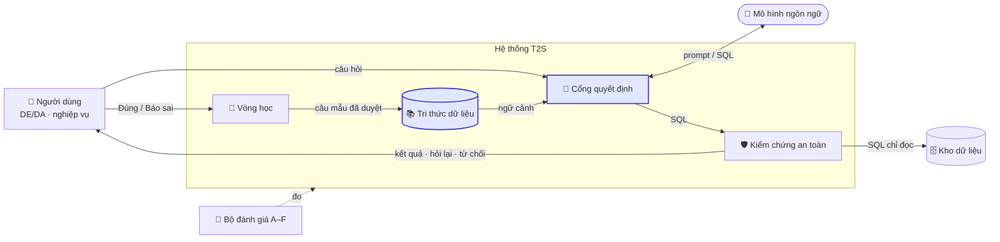
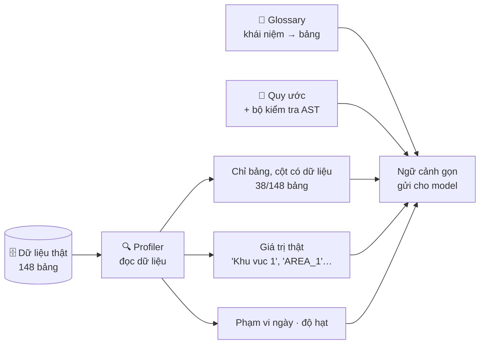
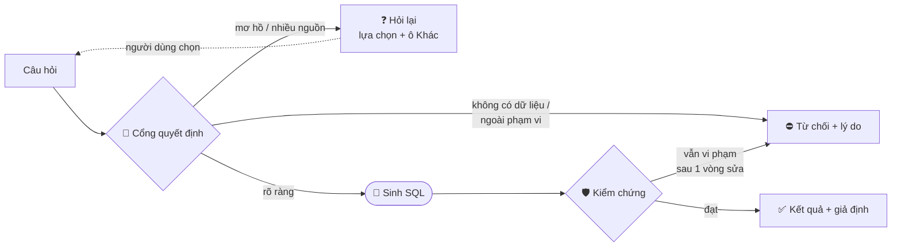

# Nội dung slide (bản 2, rút gọn): T2S VTNet

Tổng cộng 13 slide. Mỗi slide gồm **Trên slide** (ít chữ) và **Nói** (lời dẫn ngắn).
Số liệu: `sample data/synthetic/vtnet-mini-review/08_verified_context_results.md`, lượt chạy đầy đủ với `gpt-oss-120b`, 123 câu.

| Phần | Slide |
|---|---|
| Vấn đề | 1–4 |
| Giải pháp | 5–7 |
| Đánh giá | 8–10 |
| Demo và hướng phát triển | 11–13 |

---

## PHẦN 1 — VẤN ĐỀ

### Slide 1 — Tiêu đề

**Trên slide**
- **T2S VTNet: hỏi dữ liệu mạng bằng tiếng Việt**
- *Đúng, hoặc hỏi lại, hoặc từ chối. Không đoán.*

---

### Slide 2 — Ai đang gặp vấn đề gì

**Trên slide**

| | DE / DA | Người dùng nghiệp vụ |
|---|---|---|
| **Gặp gì** | Mỗi yêu cầu ad-hoc phải tra bảng, khóa nối, quy ước ngầm | Không biết dữ liệu nằm ở bảng nào; phải nhờ DE/DA rồi chờ |
| **Hậu quả** | Mất 5–10 phút cho mỗi yêu cầu nhỏ *(ước lượng)*; bị ngắt quãng việc chính | Chờ đợi; nếu tự dùng công cụ AI thì **không kiểm tra được** con số đúng hay sai |
| **Cần** | Bản nháp SQL đúng quy ước để **duyệt**, thay vì viết từ đầu | Hỏi bằng tiếng Việt, **nhận số đúng hoặc được hỏi lại** |

**Nói**
- Kho dữ liệu lớn là bối cảnh chung. Nó chỉ thành vấn đề khi gây khó cho một người cụ thể.
- Với DE/DA, vấn đề là thời gian: họ biết cách làm, chỉ tốn công tra cứu.
- Với người dùng nghiệp vụ, vấn đề nặng hơn: một con số sai mà họ không phát hiện được sẽ đi thẳng vào báo cáo.

---

### Slide 3 — Vì sao "đưa LLM vào sinh SQL" chưa giải quyết được

**Trên slide**

**Con số chính: 93,2%.** Đây là tỷ lệ kết quả **sai nhưng không báo lỗi** của hệ thống Text-to-SQL cũ.

Bốn nguyên nhân gốc:
1. **Không đưa hết schema vào được.** Model phải đoán bảng và chọn nhầm.
2. **Không biết giá trị thật.** Ví dụ khu vực lưu là `AREA_1`, không phải `1`.
3. **Không biết quy ước ngầm.** KPI lưu dạng chuỗi phải ép kiểu; phải loại cell xấu; nối bảng danh mục làm số bị nhân lên.
4. **Không biết khi nào nên dừng.** Câu mơ hồ hoặc không có dữ liệu thì model vẫn bịa ra một câu SQL.

**Nói**
"SQL chạy được không có nghĩa là đúng. Nguy hiểm nhất là câu sai mà trông vẫn hợp lý."

---

### Slide 4 — Bài toán đặt ra

**Trên slide**

> Xây hệ thống hỏi dữ liệu bằng tiếng Việt, mỗi câu hỏi kết thúc bằng một trong ba kết cục:
> **✅ Trả lời đúng** · **❓ Hỏi lại khi mơ hồ** · **⛔ Từ chối có lý do khi không có dữ liệu**

Ràng buộc:
- **Chỉ đọc**: không sửa hay xóa dữ liệu.
- **Chạy nội bộ**: dữ liệu không ra ngoài.
- **Nhiều engine**: ClickHouse, StarRocks, PostgreSQL… cú pháp khác nhau.

Thước đo thành công: **tỷ lệ an toàn** (Safe), không chỉ tỷ lệ đúng.

**Nói**
- Bảo mật và đa engine là **ràng buộc**, không phải nỗi đau của người dùng; vì vậy gom vào đây thay vì tách thành slide vấn đề riêng.
- Mục tiêu không phải là trả lời được mọi câu, mà là không trả lời sai mà không báo.

---

## PHẦN 2 — GIẢI PHÁP

### Slide 5 — Kiến trúc tổng quan

**Trên slide:** chỉ sơ đồ. Hai khối **tô màu** là hai khối sẽ được mở ra ở slide 6 và 7.

**Gợi ý khi vẽ lại:** mỗi khối một icon, chữ tối đa 3–4 từ. Cột "Vai trò" dưới đây chỉ để người trình bày nói, không ghi lên slide.

| Khối | Icon gợi ý | Vai trò |
|---|---|---|
| Người dùng | người | Hỏi, chọn khi được hỏi lại, phản hồi |
| Tri thức dữ liệu | sách / database | Thông tin đọc từ dữ liệu thật, nghĩa nghiệp vụ, quy ước |
| Cổng quyết định | ngã rẽ | Quyết định trả lời, hỏi lại hay từ chối |
| Mô hình ngôn ngữ | robot | Chỉ viết SQL; không tự chọn dữ liệu |
| Kiểm chứng an toàn | khiên | Chỉ cho chạy một câu `SELECT`; kiểm tra quy ước |
| Kho dữ liệu | database | ClickHouse / StarRocks / PostgreSQL |
| Vòng học | vòng lặp | Phản hồi → DE duyệt → câu mẫu |
| Bộ đánh giá A–F | thước | Đo độ an toàn của cả hệ thống |

**Nói**
"Model chỉ là một khối trong hệ thống. Model không tự chọn dữ liệu, và SQL model viết ra không được chạy thẳng. Bốn nguyên nhân ở slide 3 được xử lý ở hai khối tô màu."

---

### Slide 6 — Tri thức dữ liệu: model không phải đoán

**Trên slide:** tiêu đề nhỏ *"Nguyên nhân 1–3: đoán bảng, đoán giá trị, không biết quy ước"*.

**Trước / Sau** với câu hỏi *"Khu vực 1 gồm những tỉnh nào? Cho tôi mã và tên tỉnh."*

| | SQL | Kết quả |
|---|---|---|
| **Trước** | `FROM kpi_access5g_5g_cell_peak_view WHERE CAST(area_code AS BIGINT) = 1` | ❌ Sai bảng (bảng KPI thay vì bảng vị trí). Đoán mã khu vực là số `1`. Lấy mã tỉnh làm tên tỉnh |
| **Sau** | `FROM f_location_new WHERE area_name = 'Khu vuc 1'` | ✅ Đúng bảng danh mục, đúng giá trị thật |

**Nói**
- Hệ thống cũ đưa schema cho model và để model đoán.
- Hệ thống mới đọc dữ liệu thật trước:
  - chỉ giữ 38/148 bảng có dữ liệu;
  - bảng KPI 5G có 395 cột nhưng chỉ 10 cột có dữ liệu, nên model chỉ thấy 10 cột đó;
  - model thấy giá trị thật là `'Khu vuc 1'`, nên không phải đoán.

---

### Slide 7 — Cổng quyết định: biết khi nào nên dừng

**Trên slide:** tiêu đề nhỏ *"Nguyên nhân 4: không biết khi nào nên dừng"*.

**Trước / Sau**

| Câu hỏi | Trước | Sau |
|---|---|---|
| *"Thông lượng 5G toàn quốc tháng 12/2025 là bao nhiêu?"* | ❌ Trả ra một con số, lấy từ bảng **counter 3G** của ZTE | ⛔ *"Tháng 12/2025 nằm ngoài phạm vi dữ liệu hiện có: 01/08 → 20/08/2026."* |
| *"Top 10 cell 5G có lưu lượng cao nhất ngày 20/8/2026"* | ❌ Tự chọn một nghĩa, sai bảng | ❓ *"Lưu lượng" có 3 cách hiểu: tổng / tải xuống / tải lên. Bạn chọn cách nào?* |

**Nói**
- Ở câu thứ nhất, hệ thống cũ trả lời một câu không thể trả lời, và con số trông hoàn toàn hợp lý. Đây chính là "sai im lặng".
- Hệ thống mới nói rõ lý do từ chối, hoặc hỏi lại để người dùng chọn.
- Sau khi có kết quả, người dùng vẫn thấy hệ thống đã giả định gì và có thể sửa. Phần này xem trong demo.

---

## PHẦN 3 — ĐÁNH GIÁ

### Slide 8 — Cách đánh giá

**Trên slide**

Vì sao không chỉ dùng EX (so kết quả với **một** đáp án):
- Một câu hỏi có nhiều SQL đúng: thêm cột, đổi mã thành tên, xoay bảng.
- Không thưởng cho việc hỏi lại hay từ chối đúng lúc.
- Không phân biệt "sai" với "chưa đủ căn cứ để chấm".

**Thang A–F**

| | Nghĩa | |
|---|---|---|
| **A** | Đúng; hoặc hỏi lại / từ chối đúng lúc | ✅ |
| **B** | Đúng nghĩa, khác hình thức (thêm cột, đổi mã ↔ tên, xoay bảng) | ✅ |
| **C** | Câu mơ hồ, trả lời theo một cách hiểu hợp lý | ⚠️ |
| **D** | Sai: sai số, lỗi chạy, bịa câu trả lời, từ chối câu trả lời được | ❌ |
| **E** | Đúng may mắn (SQL sai nhưng số trùng) | ❌ |
| **F** | Chưa đủ căn cứ, cần người xem | ❓ |

**Chỉ số chính: Safe = (A + B) / tổng số câu.** Câu F vẫn tính vào mẫu số.

**Nói**
"A đến D xếp từ tốt đến tệ. E và F nằm ngoài thứ tự đó: E nguy hiểm vì trông như đúng, F là chỗ máy không tự chấm được."

---

### Slide 9 — Bộ đánh giá: 123 câu hỏi

**Trên slide**

| Độ khó | Số câu | Khó ở đâu | Ví dụ |
|---|---|---|---|
| **Dễ** | 26 | Lọc, đếm, tra cứu một bảng | "Khu vực 1 gồm những tỉnh nào?" |
| **Trung bình** | 43 | Gom nhóm, ép kiểu KPI, chọn đúng bảng, câu mơ hồ | "Với từng máy chủ SBR, tổng số phiên tính cước bắt đầu và kết thúc?" |
| **Khó** | 54 | Loại trừ (cell xấu, biển đảo), cửa sổ nhiều ngày, tổng hợp nhiều cấp (tỉnh → khu vực → toàn mạng), nối nhiều domain, tránh nhân số khi nối | "Trong 7 ngày đến 20/8, bao nhiêu cell 5G xấu, không tính cell biển đảo? Tổng hợp theo tỉnh, khu vực, toàn mạng." |

| Kết cục mong đợi | Số câu |
|---|---|
| Cần trả lời | 106 |
| Không có dữ liệu → phải từ chối | 12 |
| Mơ hồ → phải hỏi lại | 5 |

**6 domain:** KPI 5G (41) · FBB (25) · cảnh báo GNOC (24) · giám sát dữ liệu (19) · vị trí (9) · KPI 4G (5)

**Nói**
"Bộ câu hỏi cố tình có câu mơ hồ và câu không có dữ liệu, vì người dùng thật sẽ hỏi như vậy."

---

### Slide 10 — Kết quả

**Trên slide:** một bảng duy nhất. Mỗi hàng thêm một khối vào hàng trên. Cùng một model cho mọi hàng.

| Cấu hình | Safe | Dễ (26) | TB (43) | Khó (54) | Hỏi lại / từ chối đúng (17) | Sai im lặng ↓ | Lỗi chạy ↓ |
|---|---|---|---|---|---|---|---|
| Hệ thống cũ | 4,9% | 1 | 2 | 3 | 0 | 93,2% | 35 |
| 📚 + Chọn bảng theo glossary | 31,7% | 11 | 17 | 11 | 0 | 64,3% | 11 |
| 📚 + Profiler dữ liệu thật | 48,8% | 19 | 22 | 19 | 0 | 49,6% | 4 |
| 📚🛡️ + Quy ước & kiểm chứng | 50,4% | 19 | 23 | 20 | 0 | 46,1% | 8 |
| **🧭 + Cổng quyết định (hệ thống đầy đủ)** | **63,4%** | **24** | **33** | **21** | **17** | **37,1%** | **0** |

Các ô Dễ / TB / Khó là số câu đạt A hoặc B. Icon ở đầu hàng là khối trên sơ đồ slide 5.

**Khi người dùng tương tác** (5 câu mơ hồ):
- Hệ thống hỏi lại đúng **5/5** câu.
- Sau khi người dùng chọn cách hiểu, trả lời đúng **1/4** câu. Ba câu còn lại sai do model: độ hạt, và bỏ sót dòng có giá trị bằng nhau.

**Nói**
- Ba bước nhảy lớn: chọn bảng, profiler, cổng quyết định.
- Câu dễ và trung bình đã tốt: 24/26 và 33/43.
- **Câu khó mới đạt 21/54.** Đây là mục tiêu của hướng phát triển.

> **Ghi chú cho người trình bày (không đưa lên slide):**
> - Con số "14/21" trong thử nghiệm chạy lại **không nên** trình bày là hiệu quả của tương tác. Hệ thống đầy đủ khi chưa có tương tác cũng đạt đúng 14/21 trên 21 câu đó; "0/21" là của hệ thống cũ. Hiệu quả thật của tương tác hiện chỉ đo được ở 5 câu mơ hồ như trên.
> - Hai cấu hình trung gian (thêm mô tả do AI viết; đưa quy ước vào prompt) được bỏ khỏi bảng vì chênh lệch nằm trong mức dao động giữa các lần chạy (±5–6 điểm).

---

## PHẦN 4 — DEMO VÀ HƯỚNG PHÁT TRIỂN

### Slide 11 — Demo (ảnh chụp màn hình)

**Trên slide:** 4–6 ảnh, mỗi ảnh một chú thích ngắn.

**Danh sách ảnh nên chụp**

| # | Chụp gì | Câu hỏi để có màn hình này | Chú thích trên slide |
|---|---|---|---|
| 1 | Câu trả lời đầy đủ: bảng kết quả, SQL, giả định đã dùng | "Mỗi khu vực có bao nhiêu tỉnh?" | Kết quả kèm SQL và giả định |
| 2 | Thẻ chọn nguồn dữ liệu (4G / 5G) và các lựa chọn cách hiểu | "lưu lượng tháng 8 theo tỉnh" | Mơ hồ thì hỏi lại, không đoán |
| 3 | Kết quả sau khi chọn; giả định ghi "Cách hiểu bạn đã chọn" | Chọn một thẻ bảng và một cách hiểu ở ảnh 2 | Người dùng quyết định cách hiểu |
| 4 | Từ chối có lý do | "Thông lượng 5G toàn quốc tháng 12/2025 là bao nhiêu?" | Không có dữ liệu thì nói rõ |
| 5 | Hỏi tiếp: thẻ câu hỏi có dòng "↳ tiếp theo" | Sau ảnh 1: "chỉ lấy khu vực 1 và thêm tên tỉnh" | Hỏi tiếp theo ngữ cảnh |
| 6 | Trang `/review`: DE sửa SQL và duyệt | Bấm "Đúng" hoặc "Báo sai" ở một câu, rồi mở "Duyệt câu mẫu" | Phản hồi thành tri thức, có người duyệt |

Có thể thêm: gợi ý khi gõ `@` để ghim bảng (dành cho DE/DA).

**Lưu ý khi chụp:**
- Chụp trên trình duyệt thật, để emoji và icon hiển thị đúng.
- Nên để khung chat rộng, hoặc bấm nút phóng to khung câu trả lời.
- Với ảnh 4, kiểm tra trước là câu hỏi ra "Từ chối". Câu này là U002 trong benchmark.

---

### Slide 12 — Hướng phát triển: nâng chất lượng

**Trên slide**

| Hướng | Làm gì | Vì sao | Đo bằng |
|---|---|---|---|
| **1. Học từ câu đã duyệt** | Tìm câu mẫu tương tự (embedding) trong các câu DE đã duyệt, đưa vào ngữ cảnh | Câu khó (21/54) sai vì cách tính: cửa sổ ngày, tổng hợp nhiều cấp. Một câu mẫu đúng quy ước giúp nhiều hơn mô tả | Safe ở nhóm câu khó |
| **2. Kiểm chứng kết quả mạnh hơn** | Tự kiểm tra độ hạt và nhân số khi nối; đối chiếu tổng theo cấp (tỉnh cộng lại phải bằng toàn mạng) | Còn 37% sai im lặng: SQL chạy được nhưng số sai. Cần bắt được trước khi trả ra | Tỷ lệ sai im lặng |
| **3. Đưa khối thật vào** | Danh mục dữ liệu từ OpenMetadata; model chạy nội bộ (vLLM); adapter ClickHouse / StarRocks / PostgreSQL; bộ câu hỏi do người dùng thật viết | Chứng minh kết quả trên dữ liệu và câu hỏi thật, không chỉ synthetic | Safe trên dữ liệu thật |

**Nói**
"Hướng 1 và 2 nhắm thẳng vào hai điểm yếu đo được: câu khó và sai im lặng. Hướng 3 đưa hệ thống từ thử nghiệm sang môi trường thật."

---

### Slide 13 — Kết luận

**Trên slide**
- Vấn đề thật: không phải "sinh được SQL", mà là **sai mà không báo**.
- Cùng một model:
  - **Safe tăng từ 4,9% lên 63,4%**;
  - hỏi lại hoặc từ chối đúng **17/17** câu;
  - **0** lỗi chạy.
- Khác biệt đến từ việc model **không phải đoán** (tri thức từ dữ liệu thật) và hệ thống **biết khi nào nên dừng** (cổng quyết định).

---

## Ghi chú cho người trình bày

### Đã bỏ hoặc gộp so với bản 1

- Không còn các mức metadata M0/M1/M2. Chỉ giữ ý "profiler đọc dữ liệu thật" ở slide 6.
- Không còn slide "Đóng góp chính". Phần việc đã làm thể hiện qua mạch trình bày: 4 nguyên nhân (slide 3) → hai khối xử lý, mỗi khối có ví dụ trước/sau lấy từ SQL thật của benchmark (slide 6, 7) → các hàng của bảng kết quả đặt tên theo khối (slide 10).
- Không còn kết quả của qwen-2.5-coder-32b.
- Không còn slide hạn chế.
- Phần tương tác chuyển vào demo (slide 11).
- Phương ngữ SQL và bảo mật gộp thành ràng buộc ở slide 4.

### Cần xác nhận trước khi trình bày

1. **Con số "5–10 phút"** là ước lượng. Nếu có số liệu ticket thì thay vào; nếu không, nói rõ là ước lượng.
2. **Model hiện gọi qua OpenRouter** (API bên ngoài) với dữ liệu synthetic. Nếu bị hỏi về "chạy nội bộ", trả lời: bản production dùng vLLM nội bộ (hướng phát triển 3).
3. **Đa engine:** code đã có khai báo phương ngữ và kiểm tra cú pháp bằng `sqlglot`, nhưng phần đã đo chỉ chạy trên DuckDB.

### Câu hỏi hội đồng có thể hỏi

| Câu hỏi | Trả lời ngắn |
|---|---|
| "63% có thấp không?" | Chỉ số này tính cả câu phải từ chối và không bỏ câu F khỏi mẫu số, nên khắt khe hơn EX. Câu dễ và trung bình đã đạt 24/26 và 33/43; câu khó là mục tiêu tiếp theo. |
| "Sao không dùng RAG để tìm bảng?" | Glossary đã tìm đủ bảng ở 102/106 câu. Thử dùng tìm kiếm từ khóa làm lớp tự động thì hệ thống mất khả năng từ chối: tìm ra bảng cho 11/12 câu lẽ ra phải từ chối. |
| "Người dùng có bị hỏi lại quá nhiều không?" | Trên 123 câu benchmark, không câu nào bị hỏi chọn bảng thừa. |
| "Kết quả có bị học thuộc đáp án không?" | Câu hỏi trùng bộ đánh giá bị chặn, không thành câu mẫu. Tuy vậy glossary do người biết benchmark viết, nên cần thêm bộ câu hỏi do người khác viết (hướng 3). |

### Câu hỏi sâu: "Cột có rất nhiều giá trị, hoặc câu hỏi có thời gian, thì làm sao model biết viết đúng giá trị?"

**Trả lời ngắn (khoảng 30 giây)**
"Model không tự đoán giá trị. Giá trị và định dạng thời gian được lấy từ dữ liệu thật và đưa vào ngữ cảnh. Thời gian trong câu hỏi được hệ thống đổi thành ngày cụ thể và kiểm tra với phạm vi dữ liệu trước khi gọi model. Nếu vẫn viết sai giá trị, kết quả rỗng sẽ bị bắt lại để model sửa, và người dùng luôn thấy hệ thống đã hiểu thế nào."

**Nếu bị hỏi tiếp**

| | Hệ thống đang làm gì | Ví dụ |
|---|---|---|
| **Cột ít giá trị** (≤ 12 giá trị khác nhau) | Profiler liệt kê **toàn bộ** giá trị thật vào ngữ cảnh | `level_important`: CRITICAL, MAJOR, MINOR, WARNING. `area_name`: 'Khu vuc 1'…'Khu vuc 4' |
| **Định dạng thời gian** | Profiler ghi phạm vi thật của cột thời gian. Quy ước ghi định dạng và có bộ kiểm tra AST | `date_hour`: '2026-08-14-08' → '2026-08-20-19'. Quy ước: chuỗi `YYYY-MM-DD-HH`, so sánh trực tiếp, không CAST |
| **Thời gian trong câu hỏi** | Hệ thống đổi thành khoảng ngày cụ thể (cả cách nói tương đối như "tuần qua"), rồi so với phạm vi dữ liệu. Ngoài phạm vi thì từ chối **trước khi** gọi model | "tháng 12/2025" → từ chối: dữ liệu chỉ có 01/08 → 20/08/2026 |
| **Viết sai giá trị** | Kết quả rỗng → báo cho model, sửa 1 vòng | |
| **Người dùng kiểm tra** | Giả định hiện ra; người dùng sửa cách hiểu | |

**Điểm chưa làm (nói thẳng nếu bị hỏi):**
- Hiện tại: cột **nhiều giá trị** (ví dụ `province_name` có 17 tỉnh, vượt ngưỡng 12) **không được liệt kê**. Người dùng gõ "Hà Nội" trong khi dữ liệu lưu 'Ha Noi', nên model có thể viết sai và chỉ được cứu nhờ vòng sửa khi kết quả rỗng.
- Hướng làm: **tra giá trị lúc hỏi**.
  - Lấy các cụm từ trong câu hỏi, tìm trong chỉ mục giá trị của cột (bỏ dấu, khớp gần đúng).
  - Chỉ đưa vào ngữ cảnh vài giá trị khớp nhất, ví dụ "Hà Nội" → 'Ha Noi' ở `province_name`.
  - Nhờ vậy cột có hàng nghìn giá trị cũng không làm dài prompt.
