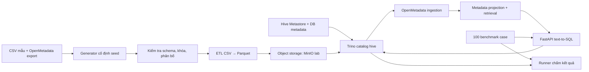

# Kế hoạch dựng telecom lakehouse lab cho text-to-SQL

**Trạng thái:** kế hoạch triển khai, chưa phải hệ thống đã dựng.  
**Mục tiêu:** mô phỏng đường đi dữ liệu `Presto.hive → OpenMetadata → text-to-SQL → truy vấn → đối chiếu đáp án` từ mẫu đã cung cấp. Lab dùng dữ liệu tổng hợp, không kết nối môi trường công ty.

## 1. Phạm vi và nguyên tắc

- Giữ tên catalog `hive`, 20 schema và tên bảng/cột gần với mẫu OpenMetadata. Thông tin có thật từ mẫu và phần giả định phải có nhãn nguồn riêng.
- Dùng **Trino + Hive connector + Hive Metastore + object storage S3-compatible** để mô phỏng đường truy vấn `Presto.hive`. Trino là lựa chọn lab; chưa xác nhận engine công ty là PrestoDB, Trino hay phiên bản cụ thể. Trino [yêu cầu metastore cho Hive connector](https://trino.io/docs/current/connector/hive.html) và [hỗ trợ S3-compatible storage](https://trino.io/docs/current/object-storage/file-system-s3.html).
- OpenMetadata là nguồn metadata cho ứng dụng; dữ liệu bản ghi nằm trong lake, không nằm trong OpenMetadata. Chỉ bật ingestion/profile/query history theo những gì được xác nhận có trong môi trường công ty.
- SQLite hiện tại tiếp tục là **oracle kiểm thử**. Câu trả lời đúng trên Trino phải được thực thi và so kết quả; không coi chuỗi `gold_sql_trino` hiện có là đã được kiểm chứng.
- Triển khai theo 3 phạm vi: **8 bảng có tên trong mẫu → 32 bảng được 100 case sử dụng → 400 bảng**. Chỉ chuyển cấp khi cổng kiểm thử đạt.

## 2. Sơ đồ lab



| Thành phần | Cấu hình lab | Trách nhiệm |
| --- | --- | --- |
| Generator/ETL | Python container chạy theo lệnh hoặc lịch | Sinh snapshot có seed, kiểm tra và ghi Parquet |
| Object storage | Một MinIO node, volume riêng | Lưu file dữ liệu; chỉ dùng làm mô phỏng S3 trong lab |
| Hive Metastore | Một service, database metadata riêng | Lưu schema, table, partition, location |
| Trino | Một node vừa coordinator vừa worker, catalog tên `hive` | Chạy SQL và đọc Parquet qua Hive connector |
| OpenMetadata | Docker Compose chính thức và dependencies theo phiên bản đã khóa | Ingest metadata từ Trino và cung cấp API metadata |
| T2S | FastAPI và frontend hiện có, LLM API bên ngoài | Lấy ngữ cảnh, sinh/kiểm tra SQL, chạy read-only trên Trino |
| Benchmark runner | Job riêng, read-only | Chạy 100 case và so kết quả với oracle SQLite |

Không triển khai Kafka, Spark hay Airflow riêng cho ETL ở bản đầu: 48.759 dòng dữ liệu chỉ cần job Python định kỳ. OpenMetadata ingestion có cơ chế vận hành riêng theo gói triển khai của nó. Mở rộng thành streaming chỉ sau khi có yêu cầu độ trễ dữ liệu thực tế.

## 3. Hạ tầng và cấu hình

| Mức | CPU | RAM | SSD | Ghi chú |
| --- | ---: | ---: | ---: | --- |
| Máy phát triển hiện có | 12 luồng | 14 GiB | còn khoảng 338 GiB | Chạy từng lớp; không chạy toàn bộ stack thường trực |
| **VM lab khởi đầu** | **8 vCPU** | **32 GiB** | **150–200 GiB SSD** | Chạy Compose, giới hạn đồng thời job ingestion/benchmark |
| Lab thoải mái hơn | 12–16 vCPU | 48–64 GiB | 200 GiB+ | Có dư địa cho OpenMetadata, search và nhiều truy vấn |

Các con số 32/48–64 GiB là **ước lượng cho stack lab này**, không phải yêu cầu chính thức của từng sản phẩm. [OpenMetadata quick start](https://docs.open-metadata.org/v1.12.x/quick-start/local-docker-deployment) cần tối thiểu 6 GiB và 4 vCPU riêng cho bản Docker; Trino cần RAM cho JVM và phần ngoài JVM. Model LLM dùng API bên ngoài nên không tính GPU. Nếu tự host model, lập ngân sách máy GPU riêng.

- Host Linux 64-bit, Docker Engine và Compose v2; khóa tag image theo phiên bản đã thử, không dùng `latest`.
- Volume bền vững cho object storage, database metastore và OpenMetadata; lưu file cấu hình/biến môi trường ngoài image. Credential qua secret hoặc file env không commit.
- Mạng nội bộ Compose cho Trino, metastore, storage và OpenMetadata. Chỉ đưa FastAPI/UI ra cổng cần thiết; không public cổng storage, search hoặc metastore.
- Nếu dùng OpenSearch của ứng dụng, `vm.max_map_count >= 262144` trên host theo [hướng dẫn OpenSearch](https://docs.opensearch.org/latest/install-and-configure/install-opensearch/docker/).
- Dùng `Asia/Ho_Chi_Minh` ở lớp hiển thị; dữ liệu giờ hiện là chuỗi `YYYY-MM-DD-HH`. ETL phải giữ được ý nghĩa giờ và xác định rõ chuyển đổi sang timestamp/UTC trước khi so đáp án.

## 4. Nguồn dữ liệu đang có và khoảng cách kỹ thuật

| Hiện trạng trong repo | Việc cần làm |
| --- | --- |
| [`sample data/synthetic/generate.py`](../../sample%20data/synthetic/generate.py) sinh 20 schema, 400 bảng, CSV và SQLite | Sinh lại từ thư mục/DB sạch, version hóa seed và snapshot. Lần kiểm tra trước thấy 3 bảng cũ còn trong SQLite (403 bảng vật lý trong khi catalog ghi 400); phải chặn trường hợp này. |
| [`sample data/synthetic/generated/catalog.json`](../../sample%20data/synthetic/generated/catalog.json) và `schema_relationships.json` có khóa/quan hệ logic | Đưa quan hệ vào metadata projection/OpenMetadata theo provenance; Hive/Trino không cưỡng chế FK, nên không trông chờ introspection tự tìm đủ 426 quan hệ. |
| [`schema_trino.sql`](../../sample%20data/synthetic/generated/schema_trino.sql) là DDL tham khảo | Tạo DDL Hive có `format`, `external_location`/table location và partition phù hợp; test trên Trino thật trước khi dùng. |
| [`cases.jsonl`](../../sample%20data/synthetic/benchmark/cases.jsonl) có 100 SQL SQLite và chuỗi đổi tên bảng sang Trino | Chạy lại 100 SQL trên Trino; chỉnh chỗ khác biệt kiểu dữ liệu, hàm và tên 3 phần; lưu đáp án thực thi của Trino riêng. |
| [`sql_candidate.py`](../../src/t2s/contracts/sql_candidate.py) và [`settings.py`](../../src/t2s/configuration/settings.py) chưa khai báo dialect Trino | Bổ sung dialect Trino xuyên suốt parser, AST guard, prompt, read-only executor, giới hạn truy vấn và test tích hợp. |
| [`runtime_service.py`](../../backend/services/runtime_service.py) hiện chọn SQLite cho UI | Thêm cấu hình lựa chọn Trino lab; không thay thế tuyến SQLite đang dùng để đối chiếu. |
| `OpenMetadataProvider` đã có nhưng mặc định pilot `openmetadata_max_assets=25` | Dùng scope cho 8/32 bảng, sau đó thiết kế phân trang/sync 400 bảng; không tăng cap tùy tiện để che lỗi thiếu dữ liệu. |

Mô tả gốc chỉ xác nhận tên và một phần cấu trúc của **8 bảng**; phần lớn 400 bảng và giá trị nghiệp vụ là tổng hợp. Theo dõi `origin`, `source_description`, `source_mapping.csv` để phân biệt chúng trong mọi báo cáo.

## 5. Các giai đoạn và cổng nghiệm thu

### G0 — Đóng băng đầu vào và kiểm tra snapshot

**Làm:** ghi manifest gồm seed, hash 4 file đầu vào, hash generator, số bảng/dòng/cột; sinh SQLite và CSV từ đầu vào sạch; chạy `validate.py` và `benchmark/build.py`.  
**Đạt khi:** đúng 20 schema, 400 bảng vật lý = 400 bảng catalog, 48.759 dòng ở snapshot hiện tại; mọi CSV khớp catalog; 100/100 oracle SQL SQLite chạy được; chạy lại cùng seed cho cùng hash. Không sửa dữ liệu nguồn.

### G1 — Dựng lớp lưu trữ và truy vấn

**Làm:** tạo Compose tách service/volume; xuất **8 bảng nguồn** ra Parquet có schema type rõ, nạp vào object storage, đăng ký dưới `hive.aaa`, `hive.aam`, `hive.acs`. Sau đó mở rộng đến **32 bảng** có trong benchmark; 400 bảng là đợt cuối. Chọn partition cho bảng giờ/ngày có đủ dữ liệu, tránh tạo hàng nghìn partition rất nhỏ.  
**Đạt khi:** `SHOW SCHEMAS`, `SHOW TABLES`, `DESCRIBE`, `SELECT COUNT(*)` chạy trên Trino; row count và giá trị null/kiểu thời gian của từng bảng khớp snapshot; restart container không mất dữ liệu. DDL Trino được sinh từ manifest và thực thi thành công.

### G2 — Nạp metadata vào OpenMetadata

**Làm:** chạy OpenMetadata theo bản Docker được khóa phiên bản; cấu hình connector Trino và ingestion theo scope. Nạp mô tả bảng/cột từ mẫu với nhãn `provided_sample`; nạp phần tự sinh với nhãn `synthetic_assumption`; đồng bộ graph quan hệ có provenance.  
**Đạt khi:** truy xuất được FQN, tên cột, kiểu dữ liệu, mô tả và quan hệ của 8 bảng đầu; ở phạm vi 32 bảng không thiếu trang/không bị cắt bởi cap 25; cùng một lần sync không tạo bản sao; có báo cáo bảng nào không có mô tả hoặc quan hệ.

### G3 — Kết nối ứng dụng T2S với Trino

**Làm:** bổ sung Trino dialect/driver và `QueryExecutorPort`; cấu hình read-only, timeout, giới hạn dòng/bytes, identity/scope và logging; lấy metadata từ OpenMetadata provider. Bật feature flag `lab_trino` để UI chọn lab, giữ SQLite làm đối chứng.  
**Đạt khi:** một truy vấn một bảng, join hai bảng và câu hỏi sự cố nhiều bảng đều đi hết `metadata → grounding → SQL → AST/access check → Trino → kết quả`; câu truy vấn ngoài scope hoặc ghi dữ liệu bị chặn; không rò credential vào log.

### G4 — Chạy benchmark và đối chiếu hai engine

**Làm:** thực thi gold SQL Trino cho 100 case, lưu `answers_trino.jsonl` kèm version snapshot/engine. Chấm hệ thống theo kết quả thực thi (không chỉ so chuỗi SQL), số, null, tập dòng và quy tắc thứ tự. Gắn nhãn từng lỗi: truy xuất sai bảng, join, sinh SQL, dialect, timeout, sai kết quả.  
**Đạt khi:** 100/100 gold SQL chạy trên Trino; kết quả đã được đối chiếu với SQLite hoặc có sai khác được giải thích bằng rule kiểu dữ liệu; báo cáo accuracy tổng và 4 độ khó, latency p50/p95, lỗi theo bước pipeline. Sau đó mới dùng điểm này đánh giá model.

### G5 — Vận hành lab và mở rộng

**Làm:** lịch sinh snapshot mới, metadata sync sau khi cập nhật bảng, backup volume/manifest, health check và dashboard đơn giản; mở dần 32 → 400 bảng. Với 400 bảng, kiểm tra retrieval, phân trang OpenMetadata, giới hạn ngữ cảnh 12 bảng và thời gian phản hồi.  
**Đạt khi:** tắt/bật stack và khôi phục snapshot thành công; các query mẫu cho kết quả giống trước; phát hiện schema drift và metadata stale; 100 case vẫn chạy sau khi mở rộng catalog.

## 6. Cấu trúc file dự kiến khi triển khai

```text
deploy/telecom_lab/
  compose.yaml                 # app, Trino, Hive Metastore, storage, ETL
  .env.example                 # tên biến, không chứa mật khẩu thật
  trino/catalog/hive.properties
  metastore/
  openmetadata/               # cấu hình theo Compose chính thức, khóa version
  scripts/export_parquet.py
  scripts/register_tables.py
  scripts/sync_metadata.py
  scripts/run_benchmark.py
  reports/                    # bỏ khỏi git nếu chứa output lớn
```

Không dùng trực tiếp `generated/schema_trino.sql` như migration production; nó chưa khai báo đầy đủ vị trí file/format/partition. Các script triển khai phải **idempotent**: chạy lại cùng snapshot không tạo bản ghi hoặc bảng trùng.

## 7. Điều cần xác nhận để tăng độ giống công ty

1. Engine thực tế là PrestoDB hay Trino, version và cú pháp SQL đang bật.
2. Storage thật là HDFS, S3-compatible hay dịch vụ khác; file format và chiến lược partition.
3. Metadata nào có thật trong OpenMetadata: mô tả, FK/lineage, profiler, sample, query history; mức freshness và chính sách truy cập.
4. Định nghĩa KPI, đơn vị đo, grain và timezone của các bảng nguồn; quy tắc join có được xác nhận hay chỉ suy ra.
5. Giới hạn truy vấn, quyền người dùng và network path của ứng dụng khi triển khai trong công ty.

Khi chưa có các thông tin này, lab được đánh giá là **mô phỏng kiến trúc và hành vi truy vấn**, không phải bản sao dữ liệu hay chính sách của công ty.
