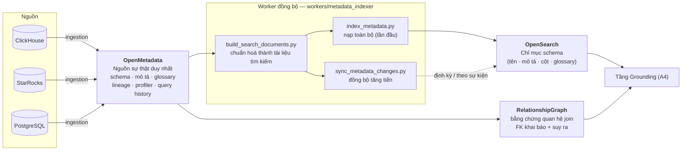
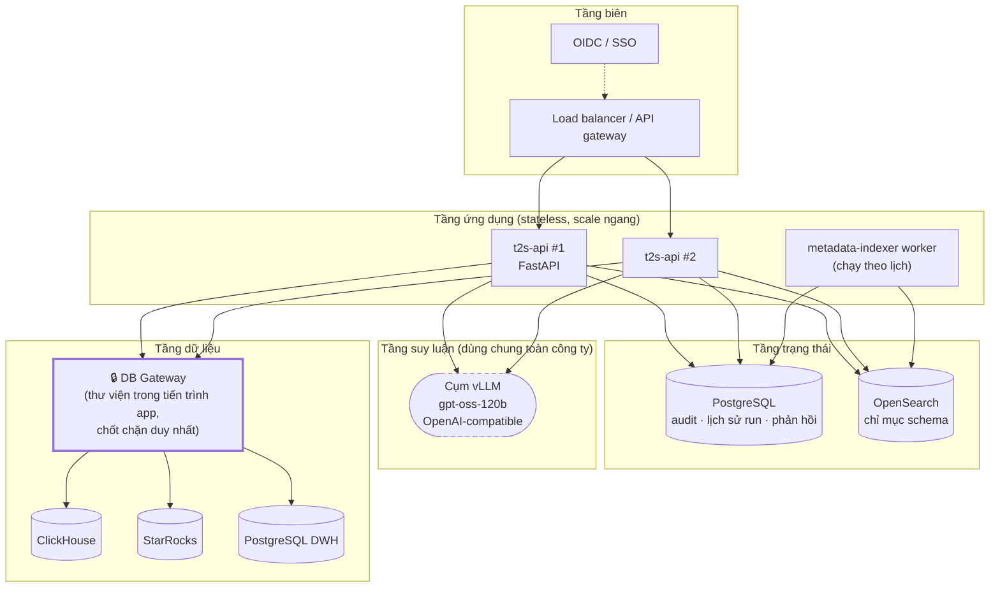

# A10 — Metadata: nguyên liệu quyết định chất lượng, và topology triển khai

**Thông điệp chính:** Chất lượng Text-to-SQL bị chặn trên bởi **chất lượng metadata**, không phải bởi kích thước model. Một bảng tên `t_ord_dtl_v2` không mô tả thì không model nào đoán đúng được. Vì vậy pipeline metadata là hạng mục hạ tầng bắt buộc, và T2S **không tự viết catalog** — nó dùng OpenMetadata làm nguồn sự thật duy nhất.

## Nội dung slide (dán thẳng)

- **Không xây lại catalog.** OpenMetadata là chuẩn OSS cấp doanh nghiệp: discovery, lineage, profiler, query history — tận dụng tối đa.
- T2S rút metadata → chuẩn hoá thành tài liệu tìm kiếm → nạp vào OpenSearch → phục vụ tầng Grounding (A4).
- Đồng bộ **tăng tiến** (chỉ phần thay đổi), không index lại 9.000 bảng mỗi lần.
- Ba nguồn làm giàu ngữ cảnh ngoài DDL: **mô tả nghiệp vụ**, **quan hệ suy ra từ lineage/query history** (vì FK thường không khai báo tường minh), **phân bố giá trị từ profiler** (phục vụ xác thực literal).

## Mermaid — Pipeline metadata

## Mermaid — Topology triển khai

## Điểm cần nói rõ về vận hành

| Hạng mục | Quyết định | Lý do |
|---|---|---|
| Tầng app | Không lưu trạng thái, scale ngang | Toàn bộ trạng thái nằm ở Postgres/OpenSearch; thêm tải chỉ cần thêm pod |
| Điểm nghẽn thực tế | Cụm vLLM dùng chung | 1 lần gọi LLM/câu hỏi là thiết kế có chủ đích (A6) — tiết kiệm đúng tài nguyên khan hiếm nhất |
| DB Gateway | Thư viện trong tiến trình, **không** là service riêng | Ít một chặng mạng, ít một điểm hỏng; đổi lại phải đảm bảo **không có đường nào chạm DB mà không qua nó** — điều này được ép bằng kiến trúc `QueryExecutorPort` |
| Đồng bộ metadata | Tăng tiến, theo lịch | 9.000 bảng: index lại toàn bộ vừa chậm vừa vô ích |
| Cấu hình môi trường | Bắt buộc có `auth_issuer`, `auth_audience` ở staging/prod, thiếu thì **không khởi động được** | `src/t2s/configuration/settings.py` — bảo mật không được phép "quên bật" |

> Chi tiết cuối cùng đáng nhấn khi trình bày: ứng dụng **từ chối khởi động** ở môi trường production nếu thiếu cấu hình bảo mật. Đây là ví dụ cụ thể của nguyên tắc fail-closed, được ép ở tầng khởi tạo tiến trình chứ không phải nhắc nhau trong tài liệu vận hành.

## Rủi ro cần nêu trong báo cáo

1. **Metadata nghèo mô tả** → trần chất lượng thấp. Hạng mục đối ứng: chương trình làm giàu mô tả cho nhóm bảng trọng điểm trước (ưu tiên theo tần suất truy vấn thật từ query history).
2. **Khoá ngoại không khai báo** → phải suy ra quan hệ từ lineage + query history; quan hệ suy ra cần được đánh dấu **độ tin cậy thấp hơn** quan hệ khai báo.
3. **Metadata lệch so với schema thật** (bảng đổi, cột bị xoá) → cần kiểm tra độ tươi (freshness) của chỉ mục và cảnh báo khi quá hạn.
