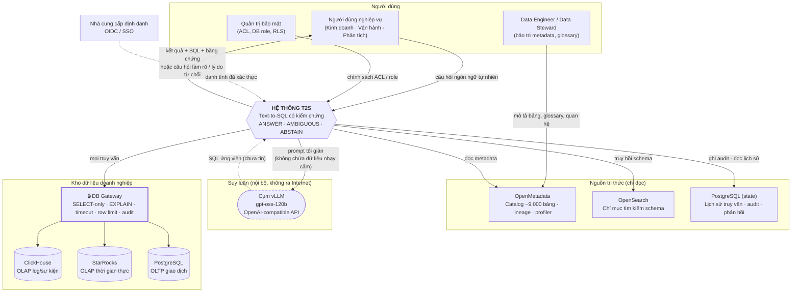

# A1 — Bối cảnh hệ thống (C4 Level 1)

**Thông điệp chính:** T2S không phải một chatbot gắn vào database. Nó là **một lớp dịch vụ có kiểm soát** nằm giữa người dùng nghiệp vụ và kho dữ liệu, dùng lại hạ tầng sẵn có của công ty (catalog, cụm vLLM nội bộ, các engine OLAP/OLTP) và **không bao giờ để LLM chạm trực tiếp vào database**.

## Nội dung slide (dán thẳng)

- **Người dùng:** nhân sự nghiệp vụ hỏi bằng tiếng Việt/Anh, không biết SQL.
- **Ba nguồn tri thức** T2S phải hợp nhất: metadata catalog (OpenMetadata), chỉ mục tìm kiếm schema (OpenSearch), và tri thức nghiệp vụ (glossary, lịch sử truy vấn).
- **Một bộ não xác suất duy nhất:** cụm vLLM nội bộ chạy `gpt-oss-120b` — dữ liệu không rời khỏi hạ tầng công ty, không gọi API thương mại.
- **Ba kho dữ liệu đích:** ClickHouse, StarRocks, PostgreSQL — truy cập **chỉ qua DB Gateway**, bằng chính quyền của người dùng.
- **Hai ranh giới tin cậy:** (1) LLM nằm ngoài vành đai tin cậy, (2) mọi truy cập dữ liệu đi qua một cửa duy nhất có kiểm toán.

## Mermaid

## Ghi chú khi vẽ

- Đặt khối `vLLM` **bên ngoài** đường bao dữ liệu, nét đứt — để người xem thấy ngay rằng LLM là bộ phận *đề xuất*, không phải bộ phận *được tin*.
- Khối `DB Gateway` vẽ viền dày: đây là "một cửa duy nhất" (single chokepoint). Cả slide bảo mật (A7) sẽ tham chiếu lại khối này.
- Nếu slide quá chật: bỏ nhóm `Người dùng` chi tiết, giữ 1 actor.

## Ánh xạ mã nguồn

| Khối trên hình | Mã nguồn |
|---|---|
| API tiếp nhận câu hỏi | `src/t2s/api/query_routes.py` |
| OpenMetadata | `src/t2s/integrations/openmetadata/` |
| OpenSearch | `src/t2s/integrations/opensearch/opensearch_metadata_index.py` |
| Cụm vLLM | `src/t2s/integrations/vllm/vllm_chat_client.py`, `src/t2s/integrations/openai_compatible/` |
| DB Gateway | `src/t2s/database/secure_query_executor.py` |
| Cấu hình endpoint hạ tầng | `src/t2s/configuration/settings.py` |

## Phản biện thường gặp

- *"Sao không dùng GPT-5/Claude cho khoẻ?"* → Ràng buộc dữ liệu: câu hỏi và metadata nghiệp vụ không được rời hạ tầng nội bộ. Kiến trúc cố tình **không phụ thuộc vào năng lực một model cụ thể**; nếu sau này đổi model, chỉ thay adapter `chat_client`, toàn bộ chốt chặn giữ nguyên.
- *"Tại sao không cho LLM tự kết nối DB qua tool-calling?"* → Vì khi đó chính sách bảo mật và giới hạn tài nguyên phụ thuộc vào việc model "nghe lời" — xem A7.
