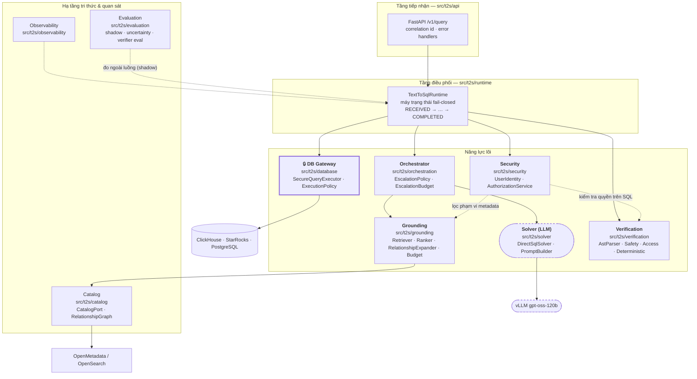

# A2 — Kiến trúc thành phần & ánh xạ mã nguồn (C4 Level 2)

**Thông điệp chính:** Toàn hệ thống chỉ có **một khối xác suất** (Solver gọi LLM). Tất cả phần còn lại — truy hồi ngữ cảnh, kiểm chứng, phân quyền, thực thi, quyết định — đều là **mã xác định, kiểm thử được, chạy lại cho kết quả giống nhau**. Đây là lý do hệ thống có thể chứng minh được hành vi thay vì "hy vọng model thông minh".

## Nội dung slide (dán thẳng)

- 9 khối chức năng, mỗi khối là một package Python độc lập, giao tiếp qua **Port/Adapter** (Protocol) — thay được từng mảnh mà không phải viết lại hệ thống.
- Đường chính (mainline) chỉ đi qua 6 khối: Security → Grounding → Solver → Verification → DB Gateway → Decision.
- Mọi khối phụ trợ (Orchestrator escalation, Semantic Verifier, Wren adapter) **có thể tắt hoàn toàn** mà hệ thống vẫn chạy đúng — không có phụ thuộc vòng.
- Điều này cho phép **đo tách bạch** đóng góp của từng chốt chặn (A/B từng tầng), thay vì chỉ có một con số tổng hợp mù mờ.

## Mermaid

## Bảng ánh xạ & trạng thái hiện thực (rất nên để cạnh hình)

| Khối | Package | Thành phần chính | Trạng thái |
|---|---|---|---|
| Tiếp nhận | `src/t2s/api` | `query_routes`, `health_routes`, `error_handlers` | 🟡 endpoint đang trả stub `abstain`, runtime được nối ở tầng dưới |
| Điều phối vòng đời | `src/t2s/runtime` | `TextToSqlRuntime`, `RuntimeState`, `RuntimeTrace` | ✅ |
| Bảo mật | `src/t2s/security` | `AuthorizationService`, `AccessPolicyPort`, `sanitization` | ✅ |
| Grounding | `src/t2s/grounding` | `SchemaRetriever`, `RetrievalRanker`, `RelationshipExpander`, `GroundingBudget` | ✅ (truy hồi từ khoá + ACL; **hybrid dense vector: chưa**) |
| Catalog | `src/t2s/catalog` | `CatalogPort`, `RelationshipGraph`, `InMemoryCatalog` | ✅ (adapter OpenMetadata đã có; index OpenSearch đã có) |
| Solver | `src/t2s/solver` | `DirectSqlSolver`, `DirectSqlPromptBuilder`, `SolverPort` | ✅ |
| Verification | `src/t2s/verification` | `SqlAstParser`, `SqlSafetyValidator`, `SqlAccessValidator`, `DeterministicSqlVerifier`, `LlmSemanticVerifier` | ✅ |
| Orchestrator | `src/t2s/orchestration` | `AdaptiveOrchestrator`, `EscalationPolicy`, `EscalationBudget` | ✅ (ngân sách mặc định: **1 lần leo thang**) |
| DB Gateway | `src/t2s/database` | `SecureQueryExecutor`, `QueryExecutionPolicy`, `QueryAuditEvent` | ✅ cho SQLite/read-only; ⬜ adapter ClickHouse/StarRocks/Postgres production |
| Đánh giá | `src/t2s/evaluation`, `benchmarks/t2s` | shadow eval, uncertainty diagnostics, verifier eval | ✅ |

> **Cách nói khi trình bày:** "Cột trạng thái này là để các anh/chị thấy rõ ranh giới giữa *đã chạy được* và *đang thiết kế*. Phần chưa xong không nằm trên đường xương sống kiến trúc, mà là adapter kết nối — thay được mà không đụng tới các chốt chặn."

## Nguyên tắc kiến trúc cần nêu miệng (không cần lên slide)

1. **Ports & Adapters:** `CatalogPort`, `SolverPort`, `QueryExecutorPort`, `AccessPolicyPort`, `SchemaSearchPort` — mọi hệ thống bên ngoài đều nằm sau một Protocol, nên test chạy được offline và đổi vendor không đụng logic.
2. **Chỉ một điểm gọi LLM trên đường chính.** Càng nhiều chỗ gọi LLM, càng nhiều chỗ để lỗi ngữ nghĩa lọt qua.
3. **Fail-closed:** mọi ngoại lệ ở tầng an toàn đều dẫn tới trạng thái từ chối, không bao giờ "thôi cứ chạy thử xem sao".
