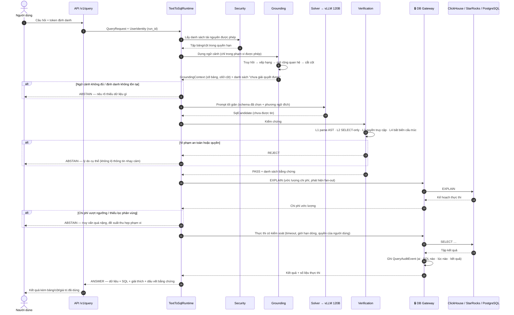
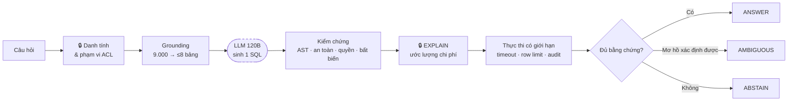

# A3 — Vòng đời của một câu hỏi (End-to-end)

**Thông điệp chính:** Giữa lúc người dùng bấm Enter và lúc nhìn thấy số liệu, câu SQL do LLM sinh ra phải **vượt qua 6 chốt chặn độc lập**. Bất kỳ chốt nào không thoả mãn đều dẫn tới `AMBIGUOUS` hoặc `ABSTAIN` — không có đường tắt "cứ chạy thử".

## Nội dung slide (dán thẳng)

- Một câu hỏi = một `run_id`, có dấu vết đầy đủ (trace) qua mọi trạng thái — kiểm toán được từng bước.
- LLM được gọi **1 lần** trên đường chính. Không có vòng lặp "nghĩ lại" chung chung.
- Trước khi chạm DB thật: parse AST → chặn không phải SELECT → kiểm tra quyền trên từng bảng/cột được tham chiếu → EXPLAIN ước lượng chi phí.
- Kết thúc luôn là 1 trong 3 trạng thái công khai: `ANSWER` / `AMBIGUOUS` / `ABSTAIN`.

## Mermaid — Sequence

## Mermaid — Rút gọn cho slide chật (nếu sequence quá dài)

## Ánh xạ mã nguồn

| Bước | Mã nguồn |
|---|---|
| Máy trạng thái vòng đời | `src/t2s/runtime/text_to_sql_runtime.py` (`execute_query_pipeline`) |
| Các trạng thái & trace | `src/t2s/runtime/runtime_contracts.py` (`RuntimeState`, `StateTransitionRecord`) |
| Dựng ngữ cảnh | `src/t2s/grounding/grounding_context_builder.py` |
| Gọi LLM | `src/t2s/solver/direct_sql_solver.py` |
| Chốt kiểm chứng | `src/t2s/verification/` |
| EXPLAIN + thực thi + audit | `src/t2s/database/secure_query_executor.py` |

**Các trạng thái kết thúc có thật trong mã** (`RuntimeStatus`): `completed`, `unresolved`, `generation_failed`, `safety_rejected`, `access_denied`, `execution_failed`, `timeout` — dùng đúng các tên này khi nói về telemetry để hội đồng thấy đây không phải sơ đồ vẽ cho đẹp.

## Phản biện thường gặp

- *"Nhiều chốt thế thì độ trễ ra sao?"* → Các chốt xác định (parse AST, kiểm tra quyền, bất biến cấu trúc) tính bằng mili-giây, chi phí thực tế nằm ở 1 lần gọi LLM và EXPLAIN. Số đo độ trễ p50/p95: `⟨TBD⟩`.
- *"Chốt nào tốn kém nhất?"* → EXPLAIN trên DB thật. Bù lại, chính nó ngăn được sự cố nghẽn cụm (A7).
