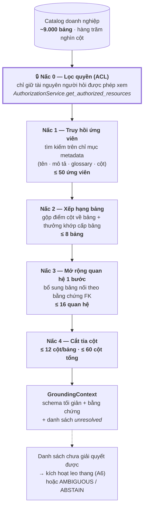

# A4 — Phễu thu hẹp: từ 9.000 bảng xuống prompt vừa một trang

**Thông điệp chính:** Không ai nhồi 9.000 bảng vào prompt được, và cũng **không nên** — *"Lost in the Middle"* (TACL 2024) cho thấy nhồi thêm còn làm giảm chất lượng. T2S giải bài toán quy mô bằng **một phễu 5 nấc có ngân sách cứng**, mỗi nấc có tiêu chí riêng và đều kiểm thử được.

## Nội dung slide (dán thẳng)

- Nấc 0 — **Phạm vi quyền (ACL)**: bảng ngoài quyền của người hỏi bị loại **trước khi truy hồi**, không bao giờ xuất hiện trong prompt.
- Nấc 1 — **Truy hồi ứng viên**: tối đa **50** ứng viên bảng/cột từ chỉ mục metadata.
- Nấc 2 — **Xếp hạng bảng**: gộp điểm theo bảng, cộng điểm cho khớp ở cấp bảng → giữ tối đa **8 bảng**.
- Nấc 3 — **Mở rộng quan hệ 1 bước**: thêm bảng nối cần thiết theo bằng chứng khoá ngoại, tối đa **16 quan hệ**.
- Nấc 4 — **Cắt tỉa cột**: tối đa **12 cột/bảng**, tổng tối đa **60 cột**.
- Kết quả: prompt ổn định về kích thước bất kể catalog phình to — chi phí token **không tăng theo số bảng của công ty**.

## Mermaid

## Ngân sách thật trong mã nguồn

`src/t2s/grounding/grounding_budget.py`:

| Tham số | Mặc định | Ý nghĩa |
|---|---|---|
| `max_candidate_tables` | 50 | Trần ứng viên sau truy hồi |
| `max_hydrated_tables` | 8 | Số bảng thực sự đưa vào prompt |
| `max_columns_per_table` | 12 | Chống bảng 300 cột làm ngập prompt |
| `max_total_columns` | 60 | Trần token cứng cho phần schema |
| `max_relationships` | 16 | Trần quan hệ join đưa vào |

Khi leo thang (`src/t2s/orchestration/escalation_budget.py`), ngân sách **được nới có kiểm soát, cộng thêm đúng một lần**: `+4` bảng, `+12` cột, `+8` quan hệ.

> Điểm mạnh khi trình bày: đây là các con số **có thể chỉnh và đo được**, không phải "tuỳ model quyết định". Chúng là tham số vận hành, sẽ được hiệu chỉnh theo dữ liệu tải thật.

## Điều cần trung thực nêu ra

- Hiện tại truy hồi dựa trên **khớp từ khoá + metadata có cấu trúc**; phần **hybrid BM25 + vector ngữ nghĩa** là bước tiếp theo, chưa nằm trong mã (`src/t2s/grounding/schema_retriever.py`).
- Chất lượng phễu này phụ thuộc chất lượng mô tả metadata trong OpenMetadata → đó là lý do A10 (pipeline metadata) là hạng mục đầu tư bắt buộc, không phải phụ kiện.

## Chỉ số đo riêng cho tầng này (đưa vào phần đánh giá)

| Chỉ số | Ý nghĩa | Giá trị |
|---|---|---|
| Schema Recall@8 | Tỷ lệ câu hỏi mà **toàn bộ** bảng cần thiết nằm trong 8 bảng được chọn | ⟨TBD⟩ |
| Column Recall | Tỷ lệ cột cần thiết còn sống sót sau cắt tỉa | ⟨TBD⟩ |
| Token ngữ cảnh trung bình | Kích thước prompt thực tế | ⟨TBD⟩ |

**Vì sao phải đo riêng:** nếu Recall@8 thấp, mọi cải tiến ở tầng LLM đều vô nghĩa — bảng đúng còn không có trong prompt thì model không thể sinh SQL đúng. Đây là chốt chặn "trần trên" của toàn hệ thống.
