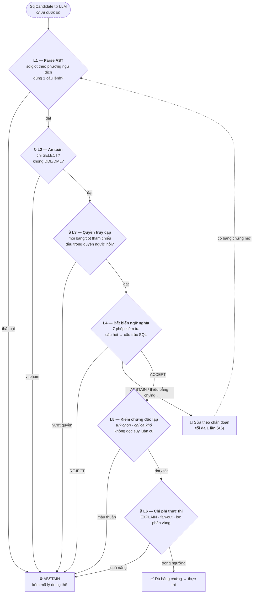

# A5 — Ngăn xếp kiểm chứng: chặn câu SQL "sai mà trông rất đúng"

**Thông điệp chính:** Rủi ro lớn nhất của Text-to-SQL không phải câu lệnh lỗi cú pháp (lỗi đó tự lộ ra), mà là câu lệnh **chạy trơn tru và trả về một bảng số liệu sai**. Vì vậy T2S không hỏi "SQL có chạy được không?" mà hỏi **"có đủ bằng chứng để tin kết quả này không?"** — qua 5 tầng, tầng nào cũng có quyền phủ quyết.

## Nội dung slide (dán thẳng)

- **L1 — Cú pháp & cấu trúc:** parse AST bằng `sqlglot` theo đúng phương ngữ đích; bắt buộc **đúng 1 câu lệnh**.
- **L2 — An toàn:** chỉ chấp nhận câu lệnh đọc. Mọi DDL/DML (`DROP`, `DELETE`, `UPDATE`, `INSERT`) bị chặn ở mức AST, không phải bằng lọc chuỗi.
- **L3 — Quyền truy cập:** mọi bảng/cột mà câu SQL **thực sự tham chiếu** được đối chiếu lại với quyền của người hỏi.
- **L4 — Bất biến ngữ nghĩa:** 7 phép kiểm tra đối chiếu câu hỏi ↔ cấu trúc SQL (xem bảng dưới).
- **L5 — Kiểm chứng độc lập (tuỳ chọn, chỉ cho ca khó):** một tiến trình LLM **không đọc chuỗi suy luận cũ**, chỉ đối chiếu yêu cầu người dùng với kế hoạch logic của câu SQL.
- Quyết định của mỗi tầng là `ACCEPT` / `REJECT` / `ABSTAIN` — **có quyền nói "không biết"**, và "không biết" thì không được trả lời bừa.

## Mermaid

## 7 phép kiểm tra bất biến ở tầng L4 (có thật trong `VerificationResult`)

| Phép kiểm tra | Câu hỏi nó trả lời | Loại lỗi nó bắt được |
|---|---|---|
| `projection` | SELECT đúng những cột người dùng cần chưa? | Trả thừa/thiếu cột, `SELECT *` cho câu hỏi cần 1 giá trị |
| `aggregation_and_grain` | Đúng mức tổng hợp (theo ngày/tháng/khách hàng)? | Sai độ hạt — nguồn lỗi *wrong_metric* phổ biến nhất |
| `filters_and_values` | Điều kiện lọc có khớp yêu cầu và giá trị có thật? | **Bịa literal** — trạng thái `'COMPLETED'` trong khi DB lưu `1` |
| `join_semantics` | Join đúng khoá, có gây nhân bản dòng không? | Fan-out làm tổng doanh thu bị nhân lên |
| `ordering_and_limit` | "Top 5", "cao nhất" đã có ORDER BY + LIMIT đúng? | Trả nhầm 1 dòng ngẫu nhiên thay vì dòng lớn nhất |
| `null_semantics` | NULL được xử lý đúng trong đếm/trung bình? | `COUNT(col)` bỏ sót NULL, `AVG` lệch |
| `schema_reference` | Mọi định danh có tồn tại trong schema? | Bịa tên bảng/cột |

Ánh xạ mã nguồn: `src/t2s/verification/contracts.py`, `src/t2s/verification/deterministic_verifier.py`.

## Vì sao nhiều tầng mà không trùng nhau

| Tầng | Nguồn sự thật | Sai được không? |
|---|---|---|
| L1–L3 | Ngữ pháp SQL + chính sách phân quyền | Không — hoàn toàn xác định |
| L4 | AST + metadata schema | Có thể trả `UNKNOWN`, nhưng **không bịa** |
| L5 | Một model độc lập | Có — nên chỉ dùng như *gate bổ sung*, không bao giờ là trọng tài duy nhất |
| L6 | Kế hoạch thực thi của chính DB | Không — DB nói sự thật về chi phí |

> Câu chốt khi trình bày: **"Chúng tôi không dùng LLM để kiểm tra LLM. LLM chỉ là tầng thứ năm trong sáu tầng, và là tầng duy nhất có thể tắt đi mà hệ thống vẫn an toàn."** Lý do: *DPC (ACL 2026)* chỉ ra LLM-as-a-Judge chia sẻ **chung điểm mù** với model sinh SQL.

## Chế độ vận hành của tầng L5 (có trong mã)

`VerifierMode` — `src/t2s/runtime/runtime_contracts.py`:
- `OFF`: tắt hoàn toàn (mặc định, đường chính rẻ và nhanh).
- `GATE_ONLY`: bật làm cổng chặn cho nhóm câu hỏi rủi ro cao.

Việc bật/tắt là **tham số vận hành**, đánh đổi giữa chi phí GPU và tỷ lệ chặn lỗi — số liệu so sánh: `⟨TBD⟩` (đã có khung đo tại `src/t2s/evaluation/verifier_evaluation.py`).
