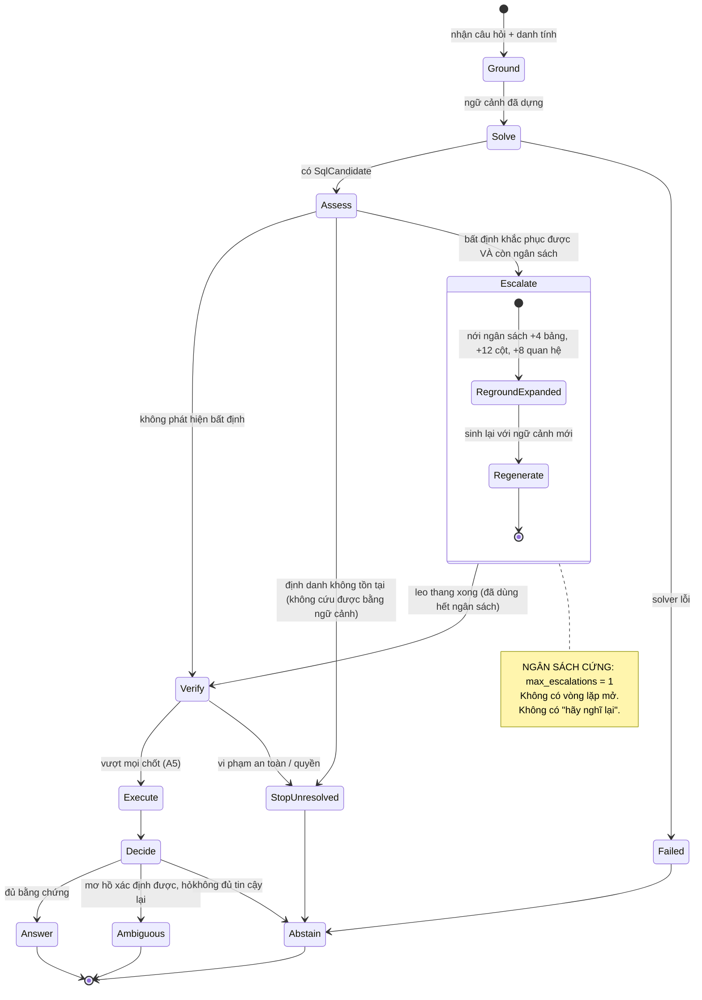

# A6 — Vòng lặp có ngân sách: khác gì "agent tự sửa"

**Thông điệp chính:** Bảo LLM "kiểm tra lại đi" mà không đưa dữ kiện mới thì nó sinh ra **đúng câu SQL cũ**. Thực nghiệm nội bộ: **855/855 ca** lặp lại y hệt (Bằng chứng I3), khớp với kết luận của *Huang et al., ICLR 2024 — "LLMs Cannot Self-Correct Reasoning Yet"*. Vì vậy T2S **xoá bỏ self-reflection chung chung**, chỉ leo thang khi có **chẩn đoán cụ thể**, và leo thang **tối đa 1 lần**.

## Nội dung slide (dán thẳng)

- Đường chính: Ground → Solve → Verify. Phần lớn câu hỏi dừng ở đây — không tốn thêm một đồng GPU nào.
- Leo thang **chỉ** được kích hoạt bởi tín hiệu có cấu trúc, không bởi "cảm giác không chắc" của model.
- Ngân sách cứng: **1 lần leo thang**, nới ngữ cảnh `+4 bảng / +12 cột / +8 quan hệ`, rồi dừng.
- Có những lỗi **cố ý không cho leo thang**: định danh không tồn tại trong schema ⇒ dừng ngay, vì nới ngữ cảnh cũng không tạo ra được bảng không tồn tại.
- Hết ngân sách mà chưa đủ bằng chứng ⇒ `ABSTAIN`. **Tiêu tiền có trần, rủi ro có trần.**

## Mermaid — Máy trạng thái

## Bảng điều kiện leo thang (có thật trong `EscalationPolicy`)

| Tín hiệu chẩn đoán (`EscalationReason`) | Hành động (`EscalationAction`) | Vì sao |
|---|---|---|
| `unresolved_identifier` | `stop_unresolved` — **dừng, không leo thang** | Bảng/cột không tồn tại; nới ngữ cảnh không tạo ra dữ liệu |
| `grounding_incomplete` | `reground_with_expanded_budget` | Thiếu ngữ cảnh ⇒ đây đúng là loại lỗi mà thêm bằng chứng cứu được |
| `relationship_ambiguity` | `reground_with_expanded_budget` | Đường join chưa rõ, cần thêm bằng chứng quan hệ |
| `solver_unresolved` | `regenerate_with_resolved_context` | Model tự báo còn điểm chưa giải quyết |
| `schema_reference_mismatch` | `stop_unresolved` | SQL tham chiếu ngoài schema đã cấp |
| Hết ngân sách | `stop_unresolved` | Trần chi phí |

Mã nguồn: `src/t2s/orchestration/escalation_policy.py`, `escalation_contracts.py`, `escalation_budget.py`.
**Điểm đáng nhấn:** `EscalationPolicy` **không gọi LLM**. Quyết định leo thang là logic xác định trên tín hiệu có cấu trúc — chạy lại 100 lần cho ra 100 kết quả giống nhau.

## So sánh trực diện (slide phụ rất hiệu quả)

| | Agentic loop thông thường | T2S Bounded Orchestrator |
|---|---|---|
| Điều kiện lặp | Model "thấy chưa ổn" | Tín hiệu chẩn đoán có cấu trúc |
| Số vòng | Không xác định (3–10+) | **Tối đa 1** |
| Dữ kiện mới mỗi vòng | Thường không có | Bắt buộc phải có (ngữ cảnh mới / chẩn đoán từ DB) |
| Chi phí xấu nhất | Không chặn trên | Có trần, tính được trước |
| Bằng chứng hiệu quả | — | I3: 855/855 ca lặp vô ích; I4: k=3 chỉ +4,68% nhưng ×3 chi phí |

## Phản biện thường gặp

- *"Chỉ 1 lần sửa thì có ít quá không?"* → Đây là **giá trị khởi điểm có cơ sở**, không phải chân lý. Bằng chứng I4 cho thấy đường cong lợi ích phẳng rất sớm. Con số này là tham số cấu hình, sẽ hiệu chỉnh theo dữ liệu tải thật; giới hạn kỹ thuật cho phép tối đa 3.
- *"Sao không sinh 5 câu rồi bỏ phiếu?"* → *CHASE-SQL (ICLR 2025)* và I4: các mẫu sinh từ cùng một góc nhìn prompt chia sẻ **chung điểm mù**, cả 5 câu cùng sai một lỗi logic. Bỏ phiếu chỉ làm cái sai trông "đồng thuận" hơn.
