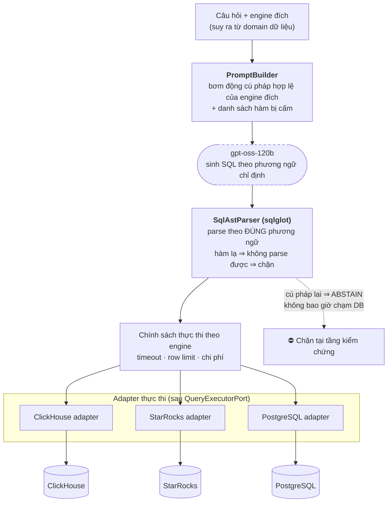

# A8 — Đa phương ngữ: một model, ba engine, không "lai tạp cú pháp"

**Thông điệp chính:** LLM được huấn luyện chủ yếu trên ANSI SQL / MySQL / PostgreSQL, nên khi phải viết cho ClickHouse hay StarRocks nó hay **ghép cú pháp lai** — câu lệnh sụp ngay tại runtime. T2S xử lý phương ngữ như **một thuộc tính hạng nhất của kiểu dữ liệu**, được ép ở ba điểm: prompt, parser, và thực thi.

## Nội dung slide (dán thẳng)

- Phương ngữ được khai báo tường minh trong hợp đồng dữ liệu: `SupportedSqlDialect = postgres | clickhouse | starrocks | sqlite`.
- **Điểm ép 1 — Prompt:** bơm động tập hàm/cú pháp hợp lệ của đúng engine đích vào prompt, kèm danh sách cấm.
- **Điểm ép 2 — Parser:** `sqlglot` parse theo đúng phương ngữ đích. Câu lệnh dùng hàm không tồn tại trên engine đó **không parse được ⇒ bị chặn trước khi chạm DB**.
- **Điểm ép 3 — Thực thi:** mỗi engine có adapter riêng sau `QueryExecutorPort`; chính sách chi phí/timeout riêng theo đặc tính engine.
- Nhờ vậy, lỗi phương ngữ chuyển từ **lỗi runtime trên production** thành **lỗi bị chặn ở tầng kiểm chứng**.

## Mermaid

## Bảng đối chiếu phương ngữ (slide này thuyết phục kỹ sư rất nhanh)

| Nghiệp vụ | PostgreSQL | ClickHouse | StarRocks |
|---|---|---|---|
| Cắt về đầu tháng | `date_trunc('month', t)` | `toStartOfMonth(t)` | `date_trunc('month', t)` |
| Ngày hiện tại | `current_date` | `today()` | `curdate()` |
| Bung mảng thành dòng | `unnest(arr)` | `arrayJoin(arr)` | `unnest(arr)` |
| Đọc JSON | `jsonb_extract_path(j,'k')` | `JSONExtractString(j,'k')` | `get_json_string(j,'k')` |
| Đọc bản mới nhất sau merge | — | `SELECT … FINAL` | — |
| Xấp xỉ số lượng phân biệt | `count(distinct x)` | `uniqExact(x)` / `uniq(x)` | `approx_count_distinct(x)` |

> Một câu `toStartOfMonth()` gửi sang PostgreSQL sẽ lỗi ngay — đó là loại lỗi *dễ*. Loại lỗi *nguy hiểm* là `count(distinct)` chạy được trên cả ba nhưng `uniq()` của ClickHouse là **xấp xỉ**: câu lệnh chạy thành công, trả về số đẹp, và **sai**. Đây đúng là dạng lỗi mà tầng L4 trong A5 tồn tại để bắt.

## Trạng thái hiện thực (trung thực)

| Hạng mục | Trạng thái | Mã nguồn |
|---|---|---|
| Kiểu phương ngữ trong hợp đồng | ✅ | `src/t2s/contracts/sql_candidate.py` |
| Parse theo phương ngữ | ✅ | `src/t2s/verification/sql_ast_parser.py` (`SQLGLOT_DIALECTS`) |
| Bơm cú pháp vào prompt | ✅ cơ bản | `src/t2s/solver/prompt_builder.py` |
| Adapter thực thi | 🟡 mới có SQLite read-only cho kiểm thử/benchmark | `src/t2s/database/sqlite_read_only_query_executor.py` |
| Ánh xạ StarRocks | ⚠️ **hiện mượn parser MySQL** của sqlglot | `sql_ast_parser.py` |

> **Điểm phải chủ động nêu ra, đừng để bị hỏi:** StarRocks đang dùng parser MySQL. Điều này đúng với phần lớn cú pháp (StarRocks tương thích giao thức MySQL) nhưng **không bao phủ các hàm riêng của StarRocks**. Đây là một rủi ro kỹ thuật đã nhận diện, có hạng mục xử lý: bổ sung bộ quy tắc kiểm tra hàm theo danh sách trắng cho từng engine. Nêu thẳng điều này sẽ làm phần khảo sát của bạn đáng tin hơn nhiều so với việc để hội đồng tự phát hiện.

## Chỉ số đo riêng cho tầng này

| Chỉ số | Giá trị |
|---|---|
| Tỷ lệ lỗi phương ngữ bị chặn ở tầng kiểm chứng (không chạm DB) | ⟨TBD⟩ |
| Tỷ lệ lỗi phương ngữ lọt xuống DB | ⟨TBD⟩ (mục tiêu ≈ 0) |
