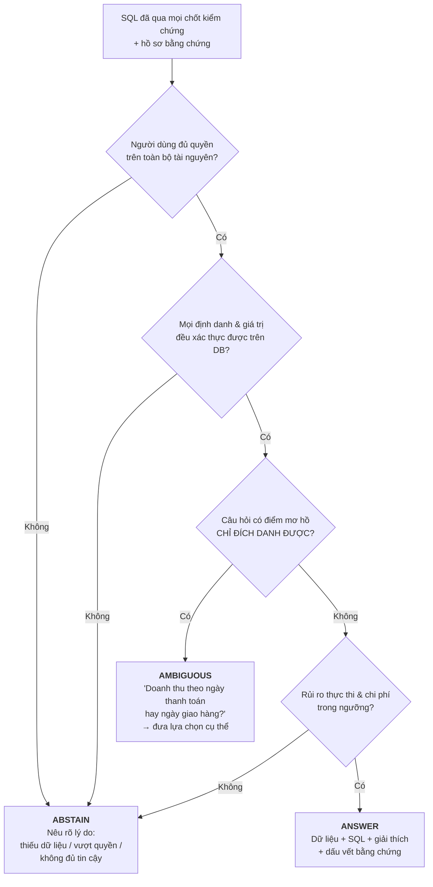

# A9 — Hợp đồng 3 trạng thái & đường Risk–Coverage

**Thông điệp chính:** Một hệ thống trả lời **100% câu hỏi** không phải hệ thống giỏi — đó là hệ thống **không biết mình đang đoán**. Giá trị của T2S nằm ở chỗ nó biết **khi nào nên im lặng**. Vì vậy chỉ số quản trị không phải "độ chính xác", mà là **cặp (Coverage, Precision)**.

## Nội dung slide (dán thẳng)

- Người dùng luôn nhận 1 trong 3 phản hồi minh bạch, không bao giờ nhận một con số không rõ nguồn gốc:
  - **`ANSWER`** — kết quả + SQL đã kiểm chứng + giải thích + dấu vết bằng chứng (đã dùng bảng nào, cột nào, giá trị nào).
  - **`AMBIGUOUS`** — chỉ đích danh điểm mơ hồ và đưa lựa chọn cụ thể, *không đoán bừa*.
  - **`ABSTAIN`** — nêu rõ lý do: thiếu dữ liệu / vượt quyền / không đủ tin cậy để chạy.
- **Một câu sai âm thầm đắt hơn mười câu từ chối.** Từ chối làm mất 2 phút của người dùng; một báo cáo sai có thể đi thẳng vào quyết định kinh doanh.
- Hệ thống được vận hành bằng **một núm xoay duy nhất**: ngưỡng bằng chứng. Xoay chặt ⇒ Coverage giảm, Precision tăng. Ban lãnh đạo chọn điểm vận hành, **không phải kỹ sư chọn hộ**.

## Mermaid — Cây quyết định



## Đường Risk–Coverage — **không vẽ bằng Mermaid**

Mermaid không vẽ được biểu đồ đường có ý nghĩa. Ba lựa chọn, theo thứ tự khuyến nghị:

**Cách 1 — Biểu đồ đường (đúng chuẩn khoa học, nên dùng):**
```
Trục X: Coverage (0% → 100%)   Trục Y: Precision trên các câu đã trả lời
Một đường cong đi xuống + một đường ngang là "ngưỡng chấp nhận của nghiệp vụ" (vd. 95%)
Đánh dấu điểm vận hành đã chọn bằng một chấm to + nhãn.
```
Sinh bằng `matplotlib` từ kết quả benchmark (dữ liệu lấy từ `benchmarks/t2s/runs/`), xuất SVG.

**Cách 2 — Nếu chưa có số:** vẽ **sơ đồ khái niệm** (không có trục số), ghi rõ *"minh hoạ khái niệm — số liệu thực tế đang hoàn thiện"*. Trung thực và vẫn truyền đạt được ý.

**Cách 3 — Bảng điểm vận hành**, dễ hiểu nhất với lãnh đạo không chuyên:

| Chế độ vận hành | Ngưỡng bằng chứng | Coverage | Precision | Dùng cho |
|---|---|---|---|---|
| Thận trọng | Cao | ⟨TBD⟩ | ⟨TBD⟩ | Báo cáo tài chính, số liệu gửi ra ngoài |
| Cân bằng | Trung bình | ⟨TBD⟩ | ⟨TBD⟩ | Vận hành hằng ngày |
| Khám phá | Thấp | ⟨TBD⟩ | ⟨TBD⟩ | Phân tích thăm dò, người dùng biết SQL tự kiểm |

## Định nghĩa chỉ số (viết lại cho sạch, dùng trực tiếp trong slide)

- **Coverage** = (số câu hệ thống chọn trả lời `ANSWER`) ÷ (tổng số câu tiếp nhận)
- **Precision (chọn lọc)** = (số câu `ANSWER` đúng) ÷ (tổng số câu `ANSWER`)
- **Selective Risk** = 1 − Precision
- **Silent Failure Rate** = (số câu `ANSWER` sai) ÷ (tổng số câu tiếp nhận) ← **chỉ số quan trọng nhất với doanh nghiệp**

> Nhấn mạnh chỉ số cuối: đây là tỷ lệ hệ thống đưa một con số sai cho người dùng **mà không ai biết**. Mọi chốt chặn trong A5, A6, A7 tồn tại để kéo con số này xuống. "Độ chính xác tổng hợp" che giấu đúng con số này, nên T2S từ bỏ nó.

## Ma trận hệ quả nghiệp vụ (slide phụ tuỳ chọn)

| | Hệ thống đúng | Hệ thống sai |
|---|---|---|
| **Trả lời** | ✅ Giá trị tạo ra | 🔴 **Sai âm thầm — thiệt hại lớn nhất** |
| **Từ chối** | 🟡 Mất cơ hội nhỏ (người dùng hỏi lại/nhờ DE) | ✅ Tránh được sự cố |

Ô đỏ là ô duy nhất gây thiệt hại thật. Toàn bộ kiến trúc được thiết kế để **dồn rủi ro từ ô đỏ sang ô vàng**.

## Ánh xạ mã nguồn

- Khung đo bất định & chẩn đoán: `src/t2s/evaluation/uncertainty_diagnostics.py`
- Đánh giá shadow (chạy song song, không ảnh hưởng người dùng): `src/t2s/evaluation/shadow_evaluator.py`
- Đánh giá runtime đầu-cuối: `src/t2s/evaluation/runtime_evaluation.py`
- Bộ benchmark & kết quả: `benchmarks/t2s/`, `results/`
