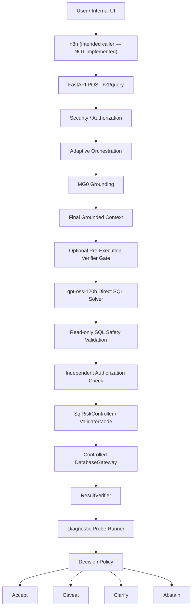
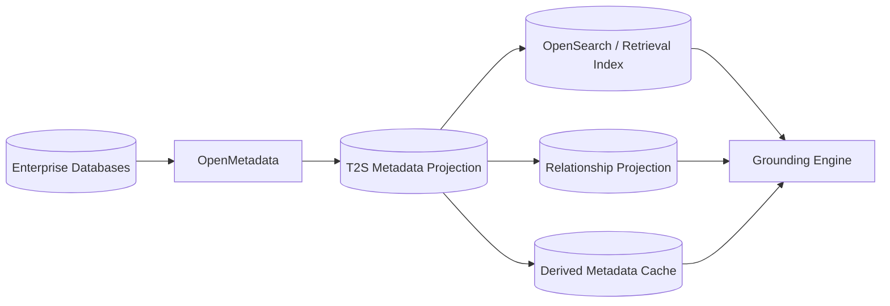
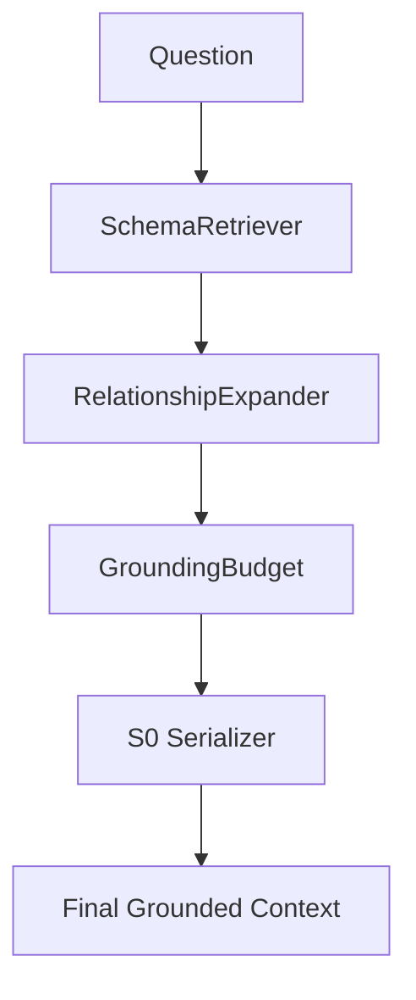
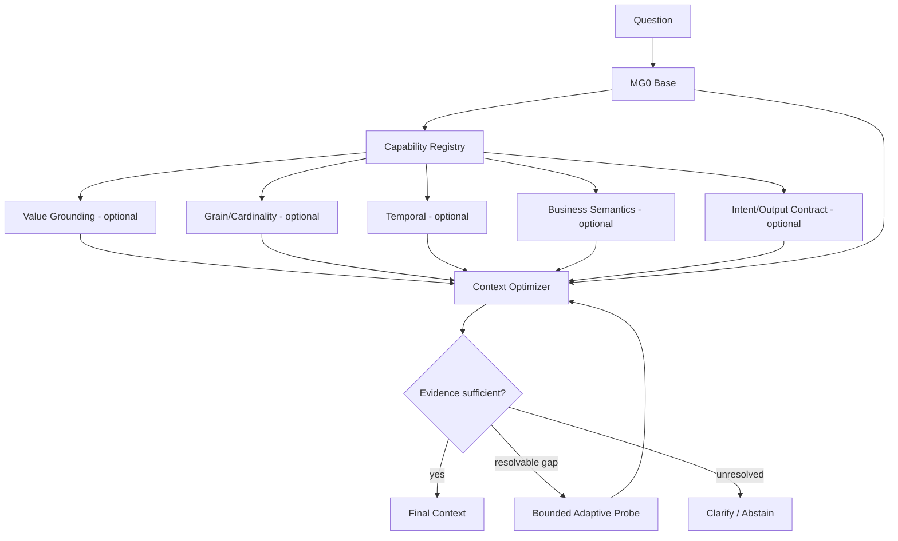

# 03 — System Architecture

**Version:** 2.0  
**Purpose:** define current runtime architecture and evidence-gated target architecture.

---

## 1. Architecture principles

1. Grounding provides facts, not the solution plan.
2. Solver remains a fixed direct SQL solver by default.
3. Deterministic validation is separate from post-execution result verification.
4. Security is enforced independently of metadata retrieval.
5. Adaptive behavior must be bounded and evidence-driven.
6. n8n orchestrates workflows; T2S owns Text-to-SQL intelligence.
7. OpenMetadata owns metadata truth; T2S owns question-specific grounding.

---

## 2. Current logical runtime

`n8n` below is the **intended caller**, not yet implemented — no n8n integration code exists in the repository. The verified current runtime starts at the FastAPI boundary. See `08_N8N_DEPLOYMENT_AND_INTEGRATION.md`.



### Important separation

- **ResultVerifier:** post-execution evidence producer.
- **SqlRiskController:** deterministic semantic/risk policy.
- **ValidatorMode:** governance mode `DISABLED / SHADOW / ENFORCE`.
- **Decision Policy:** final release decision.

These must not be merged silently in code.

---

## 3. Knowledge plane



### Ownership

| Component | Owns |
|---|---|
| Databases | data and database-native access control |
| OpenMetadata | metadata truth, glossary, ownership, lineage, profiles, usage |
| T2S projection | read-only derived representation optimized for grounding |
| OpenSearch | retrieval index, not semantic source of truth |
| Grounding Engine | question-specific context selection |

---

## 4. Current MG0 grounding runtime



Current MG0 does **not** imply production-grade:

- Temporal Grounding,
- Value Grounding,
- Grain/Cardinality Grounding,
- Glossary/metric semantic grounding,
- adaptive DB/value probing.

---

## 5. Target MG* architecture



All optional capabilities are governed by certification state.

---

## 6. Solver layer

Current default:

```text
provider-agnostic LLM client
model target: gpt-oss-120b
temperature: 0.0
direct SQL generation
```

Planner, IR, multi-solver, semantic-layer runtimes, Wren/Cube are not default mainline components.

---

## 7. Verification and controlled execution

### Pre-execution

- AST parse.
- SELECT/read-only rule.
- dialect validation.
- referenced table/column checks.
- authorization check.
- deterministic semantic/risk rules in shadow/enforce according to governance.

### DatabaseGateway

Target controls:

- read-only connection,
- query timeout: 30s current baseline,
- maximum returned rows: 1,000 current baseline,
- no DDL/DML,
- bounded retries.

### Post-execution

ResultVerifier may inspect:

- suspicious empty result,
- suspicious null-heavy result,
- row-count anomalies,
- contract mismatch signals,
- other certified post-execution checks.

It is advisory unless explicitly governed otherwise.

---

## 8. Failure paths

| Failure | Expected response |
|---|---|
| unauthorized metadata/data | deny / abstain |
| insufficient grounding evidence | clarify or abstain |
| SQL parse failure | optional bounded repair |
| SQL policy violation | reject |
| DB timeout | caveat / abstain |
| suspicious result | ResultVerifier → Decision Policy |
| ambiguous business meaning | clarify |
| unknown value semantics | bounded probe if certified; otherwise abstain |

---

## 9. Deployment topology

This is the **target/intended** topology, not a claim about what is currently running. Items marked `(not implemented)` have no executable code today.

```text
Internal User
   ↓
Internal Web UI (not implemented)
   ↓
n8n (not implemented)
   ↓
T2S FastAPI                                [current, verified]
   ├── OpenMetadata (code exists, not default provider — see 07)
   ├── OpenSearch (code exists, not wired into runtime)
   ├── PostgreSQL projection
   ├── LLM Provider                        [current, verified: gpt-oss-120b via OpenRouter]
   └── DatabaseGateway
          ├── ClickHouse   (not implemented — no executor; configuration fails closed)
          ├── StarRocks    (not implemented — no executor; configuration fails closed)
          └── PostgreSQL                   [current, verified executor]
                (SQLite executor also exists, benchmark-only)
```

