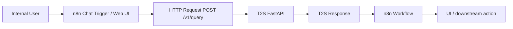

# 08 — n8n Deployment and Integration

**Version:** 2.0

---

## 1. Role of n8n

n8n is the workflow/business orchestration layer.

T2S owns Text-to-SQL intelligence.

---

## 2. Canonical runtime flow



---

## 3. Required request contract

Recommended request:

```json
{
  "question": "...",
  "dialect": "postgresql",
  "session_id": "optional"
}
```

Recommended headers:

```text
Content-Type: application/json
x-request-id: <n8n execution id>
Authorization: <internal auth mechanism>
```

---

## 4. Recommended response contract

```json
{
  "status": "accepted | caveated | clarify | abstain | error",
  "sql": "...",
  "result": [],
  "message": "...",
  "request_id": "...",
  "evidence": {},
  "risk": {}
}
```

Exact fields must follow actual API contracts.

---

## 5. Do not duplicate T2S inside n8n

Do not add an independent:

- AI SQL Agent,
- second retriever,
- direct LLM → warehouse SQL path,
- separate semantic decision engine.

That creates a second uncontrolled Text-to-SQL system.

---

## 6. Deployment workflow

1. Deploy T2S API service.
2. Configure network access from n8n to T2S.
3. Configure T2S secrets outside workflow JSON.
4. Import/create n8n workflow.
5. Send test query to `/health/ready`.
6. Send controlled `/v1/query` test.
7. Verify request ID propagation.
8. Verify no direct DB credentials exist in n8n workflow unless strictly needed for unrelated business steps.
9. Enable logs/alerts.
10. Promote workflow only after production-readiness gates pass.

---

## 7. Failure handling

| T2S status | n8n action |
|---|---|
| accepted | display/send result |
| caveated | display result + caveat |
| clarify | return clarification question |
| abstain | report safe abstention |
| error | log + user-safe error message |

