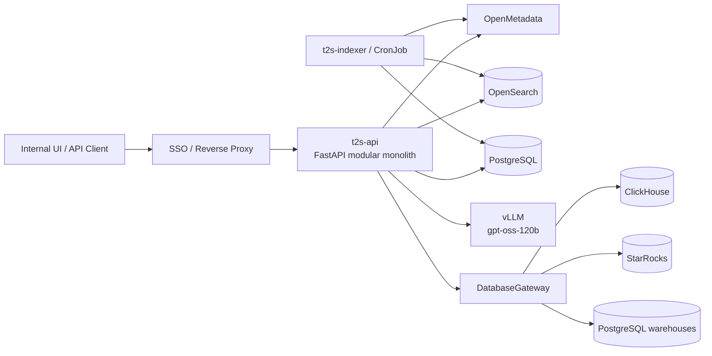

# 01 — Runtime Stack and Deployment Shape

## 1. Recommended v1 shape

Use a **modular monolith** for the online path and one stateless indexing worker/CLI for metadata refresh.

Do **not** split grounding, solver, verifier and orchestrator into network services until production profiling identifies an independent scaling or ownership need. The first risk is correctness, not service topology.

## 2. Baseline technology choices

| Concern | v1 choice | Why |
|---|---|---|
| API | Python 3.12 + FastAPI | Fast async API, typed Pydantic contracts, strong ecosystem |
| Configuration | `pydantic-settings` | Typed env/config validation |
| Domain contracts | Pydantic v2 + dataclasses/Protocol | Explicit runtime and adapter boundaries |
| Control-plane DB | PostgreSQL | Runs/audit/config/feedback/eval state |
| Schema retrieval index | OpenSearch | BM25 now; vector/hybrid can be added behind same port |
| SQL parser/AST | SQLGlot | Official ClickHouse/Postgres/StarRocks dialects [R13] |
| PostgreSQL warehouse driver | `psycopg` v3 | Async/sync support; use READ ONLY + statement timeout |
| ClickHouse driver | `clickhouse-connect` | Official Python integration [R17–R18] |
| StarRocks driver | StarRocks Python client or tested MySQL-protocol driver | StarRocks uses MySQL protocol [R19, R22] |
| LLM | OpenAI-compatible client -> company vLLM | gpt-oss-120b supports structured outputs [R1–R4] |
| Logging | `structlog` + JSON | Machine-searchable request traces |
| Metrics/tracing | OpenTelemetry + Prometheus | Cross-stage latency/error attribution |
| Migration | Alembic | Versioned control-plane schema |
| Tests | pytest + pytest-asyncio | Unit, contract and integration tests |

### Important SQLGlot boundary

SQLGlot is an AST parser/transpiler, **not the final validator**. Its own documentation warns that invalid SQL may sometimes parse. Therefore: AST guard -> dialect-specific `EXPLAIN`/dry-run -> database permissions. [R13–R14]

## 3. External systems

T2S should treat these as external dependencies behind adapters:

- OpenMetadata — metadata source, not universal business truth.
- vLLM/gpt-oss-120b — reasoning/generation runtime.
- ClickHouse/StarRocks/PostgreSQL — data plane.
- Enterprise IdP/SSO — identity source.
- Optional Wren/semantic runtime — later extension only.

## 4. Deployment stages

### Local development
`t2s-api + PostgreSQL + OpenSearch` locally; point to dev OpenMetadata, dev vLLM and test databases.

### Integration/staging
Run the same container image behind the company reverse proxy; enable real SSO claims, read-only warehouse identities and full audit.

### Production
At minimum deploy:

- 2+ stateless `t2s-api` replicas;
- PostgreSQL HA according to company standard;
- OpenSearch production cluster;
- scheduled `t2s-indexer` job;
- vLLM behind an internal network boundary;
- DB gateway egress restricted to approved warehouses.

## 5. Version pinning

Every run records application git SHA, prompt/config version, OpenMetadata/index snapshot, model/vLLM identifier, SQLGlot version and DB engine/version. OpenMetadata recommends matching the `openmetadata-ingestion`/SDK version to the server release. [R5]
