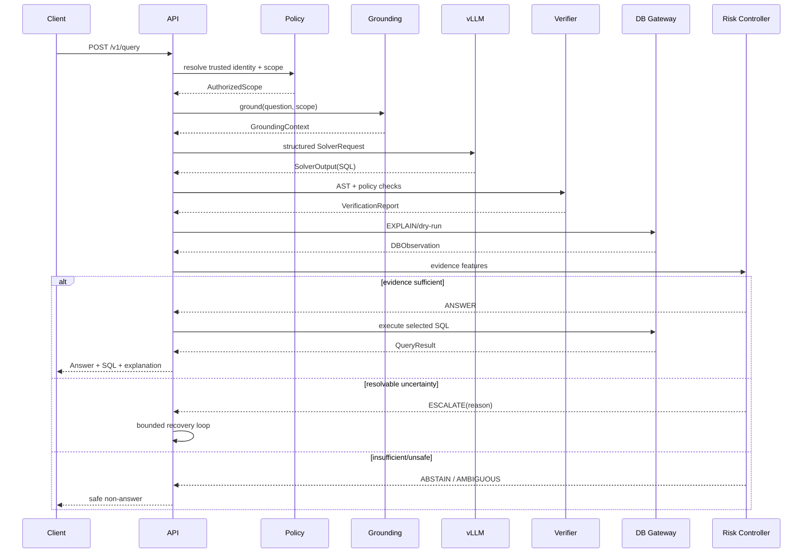

# 04 — API and Request Lifecycle

## 1. Public API v1

### `POST /v1/query`

Request:

```json
{
  "question": "Doanh thu thuần quý 3/2026 theo khu vực là bao nhiêu?",
  "locale": "vi",
  "target_hint": "finance"
}
```

Identity is resolved from the trusted request context, not JSON.

Response:

```json
{
  "request_id": "...",
  "status": "answer",
  "answer": {"columns": ["region", "net_revenue"], "rows": []},
  "sql": "SELECT ...",
  "explanation": "Uses the authorized finance sales/returns sources for Q3/2026.",
  "decision": {"score": 0.91, "policy": "risk-v1"},
  "evidence_summary": ["metadata:...", "profile:..."],
  "warnings": []
}
```

`status` is one of `answer | ambiguous | abstain | error`.

### `GET /v1/query/{request_id}`
Returns sanitized status/result for asynchronous or streamed clients if that mode is enabled later.

### `POST /v1/query/{request_id}/feedback`
Captures correctness/usefulness feedback. Do not silently convert all thumbs-up feedback into gold SQL.

### `GET /health/live`, `GET /health/ready`
Liveness only checks process; readiness checks required dependencies according to environment policy.

## 2. Internal/admin endpoints

- `GET /internal/index/status`
- `POST /internal/index/sync` (protected/admin-only; production may prefer CronJob instead)
- `GET /internal/query/{id}/trace` (operator-only; never expose raw sensitive trace to end users)

## 3. Synchronous request sequence



## 4. Error policy

- Auth/ACL failure -> fail closed; do not call LLM with hidden metadata.
- Metadata unavailable -> degrade only if a documented safe local snapshot exists; otherwise abstain/error.
- vLLM unavailable -> no generated answer.
- DB timeout -> no fabricated result.
- Risk/verification component unavailable -> follow explicit lower-assurance policy; no silent bypass.

## 5. Idempotency and traceability

Use a generated `request_id` plus optional client request ID. Every stage logs a common trace ID. Retrying the HTTP request must not accidentally duplicate expensive warehouse actions without the orchestrator knowing they already occurred.
