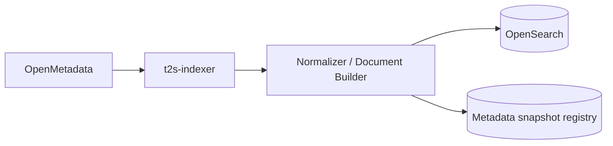

# 06 — Metadata Index and Grounding Implementation

## 1. OpenMetadata adapter

Use the OpenMetadata SDK/REST behind `CatalogPort`. Pin the SDK/ingestion package to the server release as recommended by OpenMetadata. [R5]

OpenMetadata provides Service -> Database -> Schema -> Table hierarchy and table entities can carry columns, profiles, sample data and lineage. Search APIs exist under `/v1/search`; actual availability of query history/profiler/sample data depends on ingestion/configuration. [R6–R12]

## 2. Indexing architecture



Do not copy the entire OpenMetadata graph into application memory per request.

## 3. Index documents

Create **table documents** and **column documents**.

Suggested table fields:

```json
{
  "entity_type": "table",
  "fqn": "svc.db.schema.orders",
  "service": "svc",
  "database": "db",
  "schema": "schema",
  "name": "orders",
  "display_name": "Orders",
  "description": "...",
  "domain": ["commerce"],
  "tags": ["Tier1"],
  "glossary_terms": ["Order"],
  "column_names": ["order_id", "customer_id", "revenue"],
  "column_descriptions": ["..."],
  "metadata_version": "...",
  "updated_at": "..."
}
```

Column document includes parent table FQN, data type, description, tags/glossary, constraints and normalized aliases.

## 4. Sync strategy

### Full bootstrap
List/hydrate all relevant entities, build documents, create versioned index `t2s-schema-vNN`, then atomically switch an alias `t2s-schema-current`.

### Incremental refresh
Poll based on metadata timestamps/version or a supported change mechanism; update changed entities. Keep the full rebuild path as recovery.

Store the active index/snapshot version in every query run.

## 5. Retrieval pipeline v1

```text
authorized scope
  -> lexical BM25 table/column search
  -> merge table/column candidates
  -> hydrate top tables from OpenMetadata/local snapshot
  -> relationship expansion (declared/lineage/observed prior)
  -> context budgeter
  -> GroundingContext
```

If an approved embedding model exists, add dense retrieval behind `RetrievalPort`; do not entangle solver code with a specific vector model.

## 6. Hybrid ranking

Keep rankings explicit:

- lexical score;
- optional dense score;
- glossary exact/synonym hit;
- domain/owner/tier hints;
- validated-query overlap;
- relationship connectivity.

Do not softmax these scores and call the result a probability of correctness.

## 7. Relationship evidence

Maintain provenance and strength:

1. declared PK/FK/constraints;
2. curated business relationship;
3. validated historical query;
4. lineage/observed join frequency;
5. inferred name/type similarity.

Observed join frequency is a ranking prior, not proof that a join is correct for the current question.

## 8. Query-log adapter

Keep `QueryLogPort` separate because query logs can be partially inside OpenMetadata and partially external. OpenMetadata itself documents that query-log support varies by database and supports external log-file ingestion. [R12]

Only queries with a validation/trust policy should become few-shot examples. Raw historical SQL can contain legacy errors.

## 9. Value grounding v1

Implement in this order:

1. literal/date extraction from question;
2. glossary/alias normalization;
3. profile/sample lookup if available and safe;
4. exact indexed value lookup for approved low-cardinality columns;
5. safe parameterized DB probe when uncertainty remains and policy allows.

Never copy high-cardinality or sensitive column values into a global index without explicit governance approval.

## 10. Context budgeter

Serialize only selected tables/columns, not full descriptions for everything. Include:

- compact table purpose;
- selected columns + types;
- relationship evidence + provenance;
- grounded values/time;
- relevant business terms;
- at most a few validated examples.

The solver must see enough evidence to answer, but irrelevant context is itself an accuracy risk.
