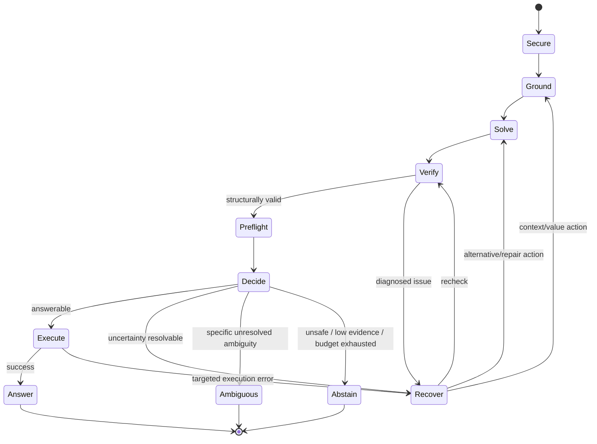

# 09 — Orchestrator and Risk Controller

## 1. Orchestrator is a state machine

It does not freely choose tools. It maps diagnosed uncertainty to an allow-listed action.



## 2. Action taxonomy

```python
class NextAction(str, Enum):
    ANSWER = "answer"
    ABSTAIN = "abstain"
    AMBIGUOUS = "ambiguous"
    EXPAND_SCHEMA = "expand_schema"
    PROBE_VALUE = "probe_value"
    REPAIR_SQL = "repair_sql"
    ALTERNATIVE_SOLVER = "alternative_solver"
    SEMANTIC_VERIFY = "semantic_verify"
```

Every transition must add an `ActionRecord(reason, evidence_before, evidence_after, cost)`.

## 3. Initial risk policy (v0)

Do **not** invent a calibrated probability before labeled evidence exists. Start with a conservative rule policy:

### Hard stop / block

- identity or authorization unresolved;
- write/admin SQL or unauthorized table reference;
- parse/preflight failure after allowed repair;
- critical unresolved value/business term required for semantics;
- DB gateway safety failure.

### Answer-eligible

- no hard block;
- required grounding coverage checks pass;
- EXPLAIN/dry-run succeeds;
- no high-risk verifier flags;
- query shape matches requested output shape;
- budget/policy allows execution.

### Escalate

Only if a concrete action can plausibly resolve the issue and budget remains.

## 4. Risk model v1

After enough labeled runs, train/calibrate a small transparent model (e.g., logistic regression + held-out/cross-validated calibration) using signals such as:

- retrieval rank margins/coverage;
- unresolved binding count;
- relationship provenance;
- AST/check findings;
- preflight success/errors;
- candidate diversity/agreement if multi-solver enabled;
- semantic verifier score if enabled;
- complexity/dialect slice.

The target is correctness of the final answer, not “model confidence”. Report risk–coverage curves and calibration.

## 5. Budget defaults

Start conservatively:

```yaml
max_rounds: 2
max_solver_calls: 3
max_schema_expansions: 2
max_db_probes: 4
max_repairs: 1
max_verifier_calls: 1
```

These are implementation defaults, not research conclusions. All are configuration, logged per run.

## 6. Example recovery logic

```python
if report.has("UNKNOWN_COLUMN") and budget.can_repair:
    return REPAIR_SQL
if grounding.has_critical_unresolved_value and budget.can_probe:
    return PROBE_VALUE
if grounding.schema_recall_warning and budget.can_expand:
    return EXPAND_SCHEMA
if candidate_semantic_uncertainty and budget.can_verify:
    return SEMANTIC_VERIFY
return ABSTAIN
```

Generic self-reflection is intentionally absent.
