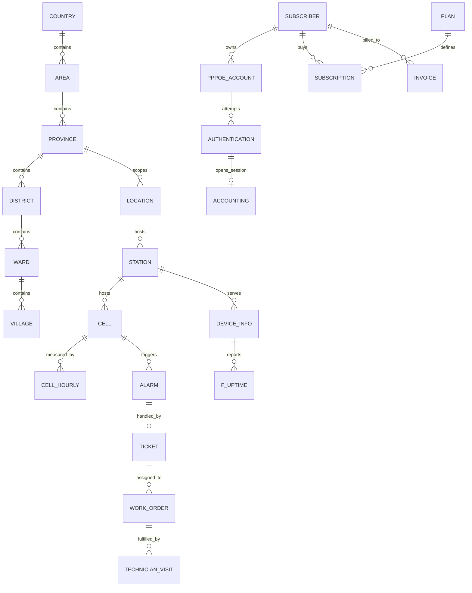

# Khóa và quan hệ dữ liệu

Nguồn đầy đủ, đọc bằng máy: [`generated/schema_relationships.json`](generated/schema_relationships.json). File này liệt kê khóa chính và 426 quan hệ từ 400 bảng. [`generated/catalog.json`](generated/catalog.json) đưa khóa chính, khóa ngoại và grain vào từng bảng để tra cứu nhanh.

## Quy ước

- `*_id` là định danh giả được sinh ổn định; mỗi bảng có một khóa chính. Bảng giờ có thể dùng khóa ghép, ví dụ `(cell_id, date_hour)` ở `ran_kpi.cell_hourly`.
- `date_hour` có dạng `YYYY-MM-DD-HH`, giờ địa phương UTC+07:00; `utc_time_ms` ở bảng KPI cell là mili giây UTC.
- Quan hệ trong JSON có hướng **bảng con → bảng cha** và lực lượng `many_to_one`. Các khóa này được kiểm tra trên dữ liệu SQLite bằng `validate.py`.
- Quan hệ ghi `basis=synthetic_assumption` là thiết kế để tạo dữ liệu thử, chưa được xác nhận từ catalog công ty. `basis=synthetic_core` là quan hệ đã dùng trong 29 bảng lõi tổng hợp; đây vẫn không phải ràng buộc đã xác minh trên hệ thống thật.

## Luồng liên kết chính



Các bảng bổ sung trong mỗi schema nối vào một **khóa cha được đặt tên rõ ràng**, chẳng hạn `acs.firmware_upgrade_event.device_id → acs.device_info.device_id`, `ran_kpi.cell_traffic_hourly.cell_id → ran.cell.cell_id`, `billing.payment.invoice_id → billing.invoice.invoice_id`. Một số bảng dùng khóa cha khác phù hợp hơn: `aaa.radius_server.location_id → geo.location.location_id`, `billing.budget_daily.station_id → inventory.station.station_id`. Sáu bảng địa lý dùng phân cấp riêng thay vì khóa cha chung.

## Ví dụ truy vấn kiểm tra quan hệ

```sql
-- SQLite: so KPI cell với tỉnh và trạm, không nhân bản dòng.
SELECT g.province_name, c.cell_id, k.date_hour, k.dl_traffic_gb
FROM ran_kpi__cell_hourly AS k
JOIN ran__cell AS c ON k.cell_id = c.cell_id
JOIN inventory__station AS s ON c.station_id = s.station_id
JOIN geo__location AS g ON s.location_id = g.location_id
WHERE k.date_hour = '2026-08-19-03';
```

Trên Trino/Hive, thay `schema__table` bằng `schema.table` và dùng catalog thực tế của công ty. Snapshot `aam.kpi_aam_daily_tdxl` có các dòng cấp `area` và `network` không có mã tỉnh; do đó bảng này **không có khóa ngoại bắt buộc** tới `geo.province`.

## Giới hạn cần xác nhận

Tài liệu mẫu chỉ mô tả 3 schema và 8 bảng, và hai CSV có tổng cộng 90 dòng. Không đủ bằng chứng để khẳng định tên, cấu trúc hay quan hệ của 371 bảng bổ sung khớp hệ thống công ty. Trước khi dùng làm benchmark chính thức, cần lấy catalog/DDL thật hoặc người phụ trách dữ liệu xác nhận các khóa, grain, công thức KPI và đơn vị đo. Tọa độ của sáu tỉnh trong dữ liệu giả là gần đúng, chỉ để thử truy vấn địa lý.
